# AIRA — Phase 1 Submission Plan

**SH-HLT-05 · AI-Enabled Early Cancer Detection, Misdiagnosis Prevention, and Screening Awareness System**
Team: PES University, RR Campus

> **How to use this file.** Every diagram below is Mermaid. Paste any block into
> <https://mermaid.live> to render and export as PNG/SVG for your slides, or drop the
> file into Notion/GitHub where it renders natively. Companion file: `understanding.txt`
> (domain depth, statistics, and judge Q&A prep).

---

## Contents

- **[Part 0](#part-0--what-you-are-being-judged-on)** — What you are being judged on
- **[Part 1](#part-1--problem-statement-understanding)** — Problem statement understanding
- **[Part 2](#part-2--solution-alignment)** — Solution alignment
- **[Part 3](#part-3--execution-plan)** — Execution plan
- **[Part 4](#part-4--non-technical)** — Non-technical: business, impact, ethics

---

# PART 0 — What you are being judged on

Phase 1 scores three things. Structure your deck in exactly this order, and make the
mapping obvious so a judge never has to hunt for it.

| Criterion | What they are actually testing | Your evidence |
|---|---|---|
| **Problem statement understanding** | Do you know *why* late diagnosis happens, mechanistically — or did you just restate the brief? | The root-cause tree, the Aarhus interval model, the base-rate insight, real numbers |
| **Solution alignment** | Does every feature trace to a stated requirement? Any orphan features? Any unmet requirements? | The traceability matrix in §2.2 |
| **Execution plan** | Is this buildable in the time, by this team, with these skills? Do they know what they will *not* build? | The 48-hour schedule, ship gates, risk register, explicit non-goals |

**The single highest-leverage slide in the whole deck is the traceability matrix (§2.2).**
It is the only slide that directly answers criterion 2, and almost no team builds one.

---

# PART 1 — Problem statement understanding

## 1.1 The problem, restated precisely

People do not mainly die of cancer in India because treatment is unavailable. They die
because the cancer is found late. Three mechanisms produce lateness, and they are
different problems requiring different solutions:

1. **The symptom is never brought to care** (appraisal + help-seeking failure)
2. **The symptom is brought to care repeatedly and dismissed** (diagnostic failure)
3. **The person was never screened despite being eligible** (programme delivery failure)

Most teams will build for (1) only. The brief explicitly asks for all three.

## 1.2 Root cause tree

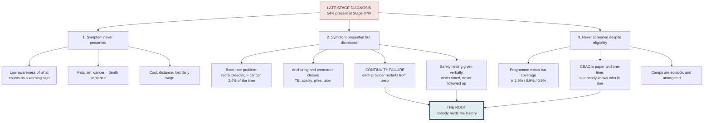
```mermaid
flowchart TD
    A["LATE-STAGE DIAGNOSIS<br/>54% present at Stage III/IV"] --> B["1. Symptom never presented"]
    A --> C["2. Symptom presented but dismissed"]
    A --> D["3. Never screened despite eligibility"]

    B --> B1["Low awareness of what<br/>counts as a warning sign"]
    B --> B2["Fatalism: cancer = death sentence"]
    B --> B3["Cost, distance, lost daily wage"]

    C --> C1["Base-rate problem:<br/>rectal bleeding = cancer 2.4% of the time"]
    C --> C2["Anchoring and premature closure<br/>TB, acidity, piles, ulcer"]
    C --> C3["CONTINUITY FAILURE<br/>each provider restarts from zero"]
    C --> C4["Safety netting given verbally,<br/>never timed, never followed up"]

    D --> D1["Programme exists but coverage<br/>is 1.9% / 0.9% / 0.9%"]
    D --> D2["CBAC is paper and one-time,<br/>so nobody knows who is due"]
    D --> D3["Camps are episodic and untargeted"]

    C3 --> E["THE ROOT:<br/>nobody holds the history"]
    C4 --> E
    D2 --> E

    style A fill:#f6e4e2,stroke:#a5352b
    style E fill:#e0eef1,stroke:#0d5a6b,stroke-width:3px
```

**The insight this tree produces:** three of the strongest branches converge on one root
cause — *no one holds the longitudinal record*. That is not a clinical problem. It is an
**information architecture problem**, and software can fix it. This is why AIRA exists.

## 1.3 The delay pathway and where AIRA intervenes

This uses the **Aarhus Statement (BJC, 2012)** and the **Model of Pathways to Treatment
(Walter et al.)** — the internationally accepted way to decompose "delay" into measurable
intervals. Using this vocabulary instantly signals domain literacy.

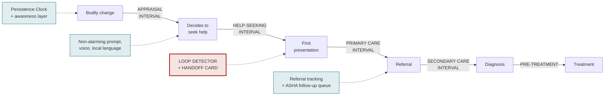
```mermaid
flowchart LR
    S1["Bodily change"] -->|APPRAISAL<br/>INTERVAL| S2["Decides to<br/>seek help"]
    S2 -->|HELP-SEEKING<br/>INTERVAL| S3["First<br/>presentation"]
    S3 -->|PRIMARY CARE<br/>INTERVAL| S4["Referral"]
    S4 -->|SECONDARY CARE<br/>INTERVAL| S5["Diagnosis"]
    S5 -->|PRE-TREATMENT| S6["Treatment"]

    A1["Persistence Clock<br/>+ awareness layer"] -.-> S1
    A2["Non-alarming prompt,<br/>voice, local language"] -.-> S2
    A3["LOOP DETECTOR<br/>+ HANDOFF CARD"] -.-> S3
    A4["Referral tracking<br/>+ ASHA follow-up queue"] -.-> S4

    style A3 fill:#f6e4e2,stroke:#a5352b,stroke-width:3px
    style A1 fill:#e0eef1,stroke:#0d5a6b
    style A2 fill:#e0eef1,stroke:#0d5a6b
    style A4 fill:#e0eef1,stroke:#0d5a6b
```

**Why the primary care interval is the right target:** it is the longest modifiable
interval for many cancers, it is where the information loss happens, and it is the only
interval a cheap software intervention can act on — because it needs memory and rules,
not new diagnostic hardware.

## 1.4 The evidence base — the numbers to put on slides

| Fact | Value | Source |
|---|---|---|
| India new cancer cases / deaths, 2022 | 1,413,316 / 916,827 | GLOBOCAN 2022 |
| Mortality-to-incidence ratio, India vs HIC | ~0.65 vs ~0.4 | Derived from GLOBOCAN |
| Present at Stage III/IV, all sites | **54%** | Trivandrum registry, JCO GO 2019 |
| Stage III/IV — oral cavity | **67%** | Same |
| Stage III/IV — lung | 88% | Same |
| 5-yr survival, breast, Stage I → IV | **100% → 23%** | Statistics Canada |
| Saw GP ≥3 times before referral | **18.1%** of 73,462 | NHS audit / BJGP |
| Rectal bleeding → colorectal cancer PPV | **2.4%** men, 2.0% women | Hamilton, BMJ 2007 |
| NICE urgent-referral risk threshold | **3% PPV** | NICE NG12, 2015 |
| Ever screened — cervical / breast / oral | **1.9% / 0.9% / 0.9%** | NFHS-5 |
| Cancer catastrophic health expenditure | **79%** | PLOS One 2018 |
| PM-JAY cancer care expenditure | **₹4,800 crore** | NHA |

## 1.5 The three sentences that prove understanding

> **On the mechanism —** "Rectal bleeding predicts colorectal cancer about two times in a
> hundred. The doctor who says 'it's probably piles' is right 98 times out of 100. The
> error is not the first benign explanation — it is the second and third, when nobody
> updates on the fact that the benign explanation has failed."

> **On the scale of the gap —** "In the NHS, with universal coverage, electronic records
> and a national two-week referral standard, one in five cancer patients still saw their
> GP three or more times before referral. Now remove all three safeguards. That is rural
> India."

> **On what is actually missing —** "India already has a national cancer screening
> programme for adults over thirty. Coverage is under two percent. The policy is not
> missing. The last mile is."

## 1.6 Primary field research — NGO interviews

**This is your single biggest advantage over every other team, and it must be on a slide
early.** Most teams will cite papers. You conducted primary research: structured
interviews with four cancer NGOs and hospital trusts, using a consistent six-question
protocol, plus a public survey.

> ⚠️ **Verify the spelling of every NGO name and contact before publishing.** Anonymise
> individual names and phone numbers on any public slide — use "a programme coordinator
> at CPAA," not a personal name and number. Get verbal consent to cite the organisation.

### The interview protocol

Six questions, asked identically to every organisation — which is what makes the
convergence meaningful rather than anecdotal:

| # | Question |
|---|---|
| i | What is the main reason for delay? |
| ii | Which symptoms get ignored? |
| iii | Do patients receive repeated treatment without improvement? |
| iv | How are symptoms tracked today? |
| v | What are the barriers to screening? |
| vi | What would the ideal tool look like? |

### Organisations interviewed

| # | Organisation | Location |
|---|---|---|
| 1 | **CanKids KidsCan** | Bengaluru |
| 2 | **Cancer Patients Aid Association (CPAA)** | Maharashtra |
| 3 | **Sanjeevani** | Maharashtra |
| 4 | **Bangalore Hospital Trust** | BTM, Bengaluru |
| — | *Love Heals Cancer* | South Bengaluru *(contacted)* |

### Findings, by question

| Q | CanKids KidsCan | CPAA | Sanjeevani | Bangalore Hospital Trust |
|---|---|---|---|---|
| **i · Delay reason** | Delayed *recognition*; rural distance to urban hospital | Poverty, household debt, "not taking life seriously" | Poverty, negligence | Cancer's slow onset leads people to believe nothing is serious |
| **ii · Ignored symptoms** | Unexplained low-grade fevers, fatigue | Fever, breast lumps, abnormal post-menopausal bleeding | Weight loss, fever, post-menopausal changes | Dry cough |
| **iii · Repeated treatment?** | **Yes — multiple rounds of anti-typhoid and anti-malarial therapy, but CBC never done** | **Yes — women repeatedly prescribed antibiotics, but ultrasound never done** | **Yes — unnecessary antibiotics, but endoscopy never done** | **Yes — symptomatic treatment given; should have gone for ultrasound** |
| **iv · How tracked today** | Poor care coordination; fragmented care | Manual **spreadsheets**, patient history | Patient keeps track of his own history | — |
| **v · Screening barriers** | Loss of working days, travel cost | Poverty | Cultural negligence, poverty | — |
| **vi · Ideal tool** | **"Patient timeline"** | **"A tracker helps"** + connect to good doctors | **Native language, no English** | — |

### The two findings that should be on a slide, in large type

```
FINDING 1 — Four out of four organisations independently reported the
same failure: patients receive repeated courses of empirical treatment
(antibiotics, anti-typhoid, anti-malarial) while the basic diagnostic
test — CBC, ultrasound, endoscopy — is never ordered.

That is not a metaphor for our Loop Detector.
That is literally its L1 state: two or more encounters,
same symptom, zero investigations.
```

```
FINDING 2 — When asked what tool they wanted, before we described ours:

  CanKids     →  "a patient timeline"
  CPAA        →  "a tracker helps"
  Public survey → "track your symptoms"

They asked for it. We did not propose it to them.
```

**The line to say on stage:**

> "We did not guess at this problem. We ran a six-question protocol with four cancer NGOs
> across Bengaluru and Maharashtra. Every single one independently described the same
> failure — repeated empirical treatment with no diagnostic test ordered. And when we
> asked what tool they wanted, before we told them anything about ours, they said 'a
> patient timeline.' That is what we built."

That is a stronger opening than any statistic, because no other team will have it.

### Public survey findings

**Reasons for delaying screening** — ranked:
1. Not taking life seriously
2. No money
3. Simply don't know about cancer
4. Too embarrassed
5. Fear of diagnosis and death

**Biggest barriers to a screening check** — ranked:
1. High cost
2. Too far
3. **Too many steps in the process**
4. Scared to get checked
5. No family or social support

**"Our dream help tool"**:
1. Just connect some good doctors
2. Track your symptoms

**Symptoms most people ignore**:
1. Losing weight for no reason
2. Dry cough
3. Lumps, bumps and swellings
4. Unexpected menopause / abnormal bleeding in women
5. Fatigue all day

> **Cross-check this against the literature and note the agreement.** Every one of those
> five ignored symptoms appears in NICE NG12 as a referral trigger, and four of the five
> appear in QCancer's feature set. Your field research and the published evidence base
> independently converge. Say that — it is a validity argument.

## 1.7 What the field research changes about the build

Field research that does not change the product is decoration. Three findings force real
changes, and you should show the before/after.

### Change 1 — "Too many steps in the process" is a fixable barrier nobody targets

Ranked **third**, above fear. This is a *process design* failure, not a knowledge or money
failure — which means software can actually fix it. It produces a new module:

**M13 — Navigation & Logistics layer.** For every recommendation, answer the four
questions that stop people: *Where exactly? What will it cost? What do I bring? How many
visits?* Under NHM, population screening at an HWC is free — most people do not know
that, and "No money" ranked second as a delay reason. **Telling someone the screening is
free is itself an intervention.**

### Change 2 — Embarrassment and fear are design constraints, not soft factors

"Too embarrassed" ranked 4th and "scared to get checked" 4th on barriers. This forces:

- **Private mode by default** — nothing displayed that a bystander can read; no cancer
  branding on the home screen
- **Female health worker preference** flag for breast and cervical pathways
- **Language that never uses the word "cancer" before it is necessary** — the awareness
  copy talks about "a check-up that finds problems early"
- This is also a direct argument for the **non-alarming tone** requirement in the brief —
  now backed by your own data rather than assertion

### Change 3 — "No family or social support" produces a companion feature

Ranked 5th. Add a **Companion / accompaniment flag**: a person can nominate a family
member to receive their check-back reminders and screening due dates, and the ASHA
dashboard can flag people with no support who may need accompaniment to a camp. Low build
cost, direct response to field evidence.

### Change 4 — "Just connect some good doctors" is the most-requested feature

Both CPAA and the public survey said it. It maps to a **verified referral directory** —
nearest facility by type, with the eSanjeevani teleconsultation link where available. You
do not need to build a doctor network; you need to surface the public one that already
exists and that people cannot navigate.

## 1.8 Barrier taxonomy → feature mapping

Put this table on a slide. It shows every barrier you found in the field has an answer in
the product — which is exactly what "solution alignment" means.

| Barrier (field-observed) | Rank | Type | AIRA response | Module |
|---|---|---|---|---|
| Not taking life seriously | 1 | Appraisal | Persistence Clock makes elapsed time visible and countable | M2 |
| No money / high cost | 1–2 | Structural | State plainly that NHM screening is free; show cost before travel | **M13** |
| Don't know about cancer | 3 | Knowledge | Grounded awareness layer in local language, voice-first | M6 |
| Too far / travel | 2 | Structural | Nearest-facility routing by type; teleconsult where available | **M13** |
| **Too many steps in the process** | **3** | **Process** | **Step-by-step navigation: where, cost, what to bring, how many visits** | **M13** |
| Too embarrassed | 4 | Social | Private mode; female health worker preference; non-cancer framing | **M14** |
| Fear of diagnosis and death | 5 | Psychological | Non-alarming copy; no probability shown; survival-by-stage framed as hope | M6 |
| No family or social support | 5 | Social | Companion flag; ASHA accompaniment prompt | **M14** |
| Loss of working days | — | Economic | Show visit count up front; batch screening at a single camp visit | **M13** |
| Repeated treatment, no test | — | **Clinical** | **Diagnostic Loop Detector + Handoff Card** | **M4, F07** |
| Fragmented care, spreadsheets | — | **Systemic** | **Patient-held longitudinal timeline** | M2, F06 |
| No English / native language only | — | Access | Voice-first, Sarvam + Bhashini, pictograms | M7 |

---

# PART 2 — Solution alignment

## 2.1 The product in one sentence

> **AIRA is automated, longitudinal, patient-held safety netting** — it holds a person's
> symptom and care history, runs a guideline-defined clock on every symptom, detects when
> someone is stuck in a failed treatment loop, tells them what screening they are owed,
> and hands the next clinician a printed summary of everything that has already been
> tried.

*Safety netting* is the clinical term for "come back if it doesn't settle." Today it is
given verbally, never timed, never followed up. Using the term correctly is worth a lot
with a clinician judge.

## 2.2 Requirement → feature traceability matrix

**This is your most important slide.** Every requirement in the brief has a feature; every
feature has a requirement. No orphans in either direction.

| # | Brief requirement | AIRA feature | Module | Evidence it works |
|---|---|---|---|---|
| 1 | Assess risk from age, family history, lifestyle, indicators | **Risk Tier Engine** — additive points, every contribution displayed | M1 | QCancer precedent; factor weights from published relative risks |
| 2 | Track symptoms longitudinally for persistence or escalation | **Persistence Clock** + **Check-Back Loop** — safe window per symptom, scheduled follow-up | M2, M3 | NICE NG12 safe windows |
| 3 | Detect patterns of misdiagnosis or delayed diagnosis | **Diagnostic Loop Detector** — L0→L3 ladder over care episodes | M4 | NHS repeat-consultation data; no prior art |
| 4 | Recommend screening aligned to public-health guidelines | **Screening Passport** — due/overdue/not-yet with citation | M5 | ICMR/NHM, WHO, USPSTF rulesets |
| 5 | Clear, non-alarming awareness and preventive guidance | **Grounded Explanation Layer** + awareness cards | M6 | Citation-verified generation |
| 6 | Usable urban + rural, low-literacy, local language, low network | **Offline-first PWA**, voice I/O, body-map pictograms, IVR/SMS fallback | M7 | Works in airplane mode — demoed live |
| — | *Constraint:* decision support, not diagnosis | **Decision boundary** — rules decide, models rank, LLM only phrases | M0 | Enforced in the output layer, not a footer |
| — | *Impact:* government adoption | **ASHA/CHO dashboard** + ABDM integration + CBAC positioning | M8, M9 | Extends an instrument India already mandates |
| — | *Optional:* focus cancer | **Oral Cancer Vision Module** | M10 | 67% late-stage; camera-screenable |
| — | *Awareness tip:* "repeated treatment without improvement requires further evaluation" | **Loop Detector L2 state**, stated in exactly those words to the user | M4 | 4/4 NGOs reported this exact failure |
| — | *Field-observed:* cost, distance, too many steps | **Navigation & Logistics layer** — where, cost, what to bring, how many visits | **M13** | Barriers ranked 1st, 2nd and 3rd in our survey |
| — | *Field-observed:* embarrassment, fear, no social support | **Dignity & Support layer** — private mode, female-worker preference, companion flag | **M14** | Barriers ranked 4th and 5th |
| — | *Field-observed:* "just connect some good doctors" | **Verified referral directory** + eSanjeevani link | M13 | Most-requested feature in survey and CPAA interview |
| — | *Requirement 5 depth:* awareness that is asked for, not pushed | **Awareness & Navigation Chatbot**, scope-limited by a refusal router | **M12** | Cannot produce a risk assessment by construction |

## 2.3 Feature catalogue — tiered by priority

Scope discipline is itself a judged quality. Show that you know what to cut.

### MUST — the demo fails without these

| ID | Feature | Why must |
|---|---|---|
| F01 | Risk Tier Engine with visible factor breakdown | Requirement 1; also the explainability proof |
| F02 | Symptom logging with mandatory onset date | Onset date is what starts every clock |
| F03 | Persistence Clock with NG12 safe windows | Requirement 2; the core deterministic asset |
| F04 | Care episode logging (visit, treatment, outcome) | Feeds the Loop Detector |
| F05 | Diagnostic Loop Detector L0–L3 | Requirement 3; the novelty |
| F06 | Care Timeline visualisation | The demo's money shot |
| F07 | Doctor Handoff Card, printable | Directly attacks the continuity failure |
| F08 | Screening Passport | Requirement 4 |
| F09 | Red-flag hard override | Safety floor — non-negotiable |
| F10 | Offline operation, full decision path | Requirement 6; demoed by switching wifi off |
| F11 | Seeded demo personas + time-travel control | You cannot log 3 months of symptoms on stage |

### SHOULD — strongly wanted, cut only under time pressure

| ID | Feature | Why |
|---|---|---|
| F12 | Voice input/output, 1 Indian language | Requirement 6 |
| F13 | Body-map pictogram symptom picker | Low-literacy access |
| F14 | ASHA/CHO prioritised dashboard | Government adoption story |
| F15 | Oral vision triage + Grad-CAM | Biggest visual impact |
| F16 | Check-Back Loop with scheduled prompts | Requirement 2 done properly |
| F17 | Grounded explanation with citation verifier | Responsible AI proof |

### COULD — only if ahead of schedule

| ID | Feature | Why deprioritised |
|---|---|---|
| F18 | ABDM consent flow against mock gateway | High narrative value, moderate build cost |
| F19 | Hardware field kit | Impressive but demo-risky |
| F20 | SMS/IVR fallback, working | Design + mock is enough for Phase 1 |
| F21 | Awareness chatbot (M12) | Constrained scope; easy to get wrong |
| F24 | Companion / accompaniment flag (M14) | Cheap, but not demo-critical |
| F25 | Verified referral directory with live facility data | Static per-district list is enough for Phase 1 |
| F26 | Federated learning across districts | Scale-up story only; describe, do not build |

### FIELD-DRIVEN — promoted out of COULD because the research demands them

These came directly from the NGO interviews and survey. They are cheap to build and they
are the proof that your field research changed the product rather than decorating it.

| ID | Feature | Field evidence | Cost |
|---|---|---|---|
| **F22** | **Navigation card** on every recommendation — where, **cost (free under NHM)**, what to bring, how many visits | "Too many steps" ranked 3rd; "no money" ranked 2nd | ~2 hrs — it is a JSON lookup and a card component |
| **F23** | **Private mode + non-cancer framing** in default copy | "Too embarrassed" ranked 4th | ~1 hr — copy discipline plus a display toggle |

**Why F22 is worth more than it costs.** Population screening at an HWC is free under NHM,
and "no money" was the second-ranked reason for delay. A large share of the cost barrier
is *belief about cost*, not cost. A single line of text that says "this screening is free
at your nearest Health & Wellness Centre" is a genuine intervention, and it costs you two
hours. Say this on stage — judges notice when a cheap feature is justified by evidence
rather than by taste.

### WILL NOT BUILD — say this out loud

- Any diagnostic output, disease name as conclusion, or malignancy probability shown to a lay user
- Real patient data of any kind
- Live production ABDM integration (sandbox/mock only — certification takes weeks)
- A general medical symptom checker beyond the cancer pathway
- Treatment recommendations of any kind

## 2.4 System architecture

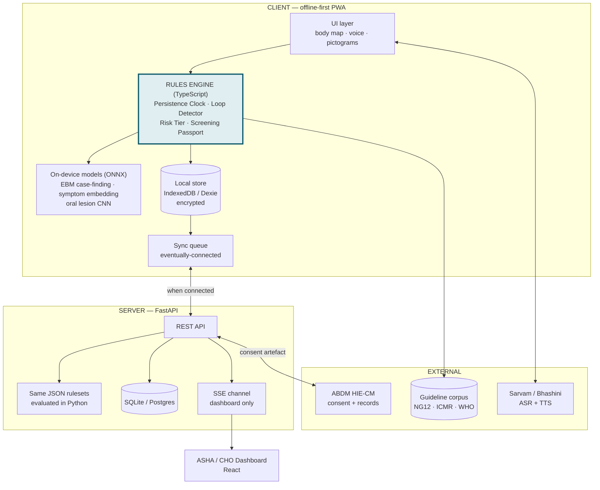
```mermaid
flowchart TB
    subgraph CLIENT["CLIENT — offline-first PWA"]
        UI["UI layer<br/>body map · voice · pictograms"]
        RULES["RULES ENGINE (TypeScript)<br/>Persistence Clock · Loop Detector<br/>Risk Tier · Screening Passport"]
        MLC["On-device models (ONNX)<br/>EBM case-finding · symptom embedding<br/>oral lesion CNN"]
        DB[("Local store<br/>IndexedDB / Dexie<br/>encrypted")]
        SYNC["Sync queue<br/>eventually-connected"]
    end

    subgraph SERVER["SERVER — FastAPI"]
        API["REST API"]
        RULESPY["Same JSON rulesets<br/>evaluated in Python"]
        PG[("SQLite / Postgres")]
        SSE["SSE channel<br/>dashboard only"]
    end

    subgraph EXT["EXTERNAL"]
        ABDM["ABDM HIE-CM<br/>consent + records"]
        VOICE["Sarvam / Bhashini<br/>ASR + TTS"]
        RAG[("Guideline corpus<br/>NG12 · ICMR · WHO")]
    end

    DASH["ASHA / CHO Dashboard<br/>React"]

    UI --> RULES
    RULES --> MLC
    RULES --> DB
    DB --> SYNC
    SYNC <-->|"when connected"| API
    API --> RULESPY
    API --> PG
    API --> SSE
    SSE --> DASH
    API <-->|"consent artefact"| ABDM
    UI <--> VOICE
    RULES --> RAG

    style RULES fill:#e0eef1,stroke:#0d5a6b,stroke-width:3px
```

**The architectural principle:** the rulesets are **versioned JSON, evaluated identically
on client and server**. One source of truth, no drift, and the entire decision path runs
offline because it is deterministic logic, not a model call.

## 2.5 The decision boundary — your responsible-AI proof

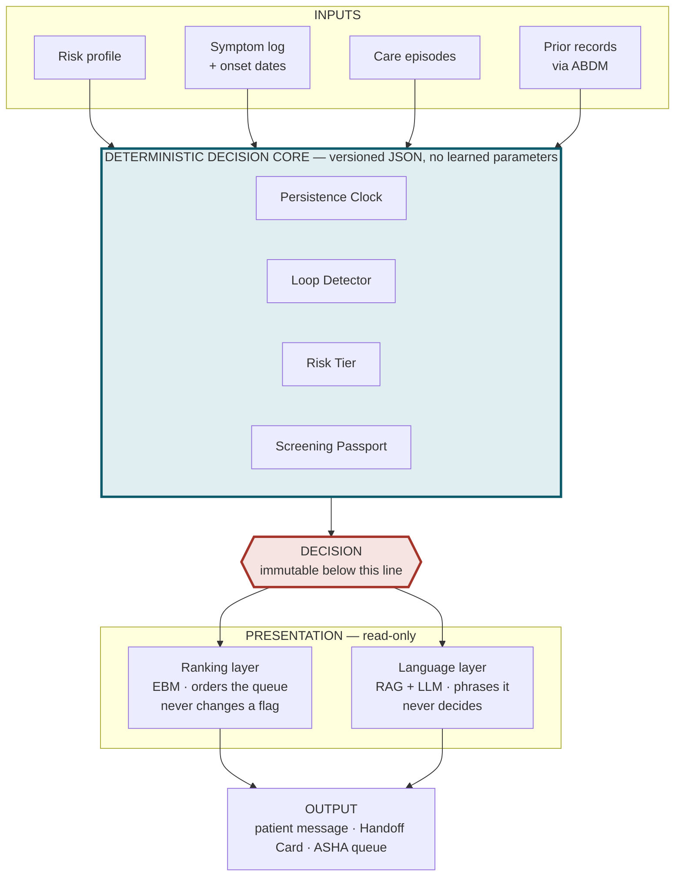
```mermaid
flowchart TB
    subgraph IN["INPUTS"]
        I1["Risk profile"]
        I2["Symptom log<br/>+ onset dates"]
        I3["Care episodes"]
        I4["Prior records<br/>via ABDM"]
    end

    subgraph CORE["DETERMINISTIC DECISION CORE — versioned JSON, no learned parameters"]
        R1["Persistence Clock"]
        R2["Loop Detector"]
        R3["Risk Tier"]
        R4["Screening Passport"]
    end

    D{{"DECISION<br/>immutable below this line"}}

    subgraph DOWN["PRESENTATION — read-only"]
        M1["Ranking layer<br/>EBM · orders the queue<br/>never changes a flag"]
        M2["Language layer<br/>RAG + LLM · phrases it<br/>never decides"]
    end

    OUT["OUTPUT<br/>patient message · Handoff Card · ASHA queue"]

    I1 --> CORE
    I2 --> CORE
    I3 --> CORE
    I4 --> CORE
    CORE --> D
    D --> M1
    D --> M2
    M1 --> OUT
    M2 --> OUT

    style CORE fill:#e0eef1,stroke:#0d5a6b,stroke-width:3px
    style D fill:#f6e4e2,stroke:#a5352b,stroke-width:3px
```

> **Say this:** "The rules make the decision. The model ranks and prioritises. The language
> model only phrases what the rules already decided. No generative component is ever in
> the decision path."

That one sentence answers explainability, safety, hallucination and offline operation
simultaneously.

## 2.6 Module specifications

### M1 — Risk Tier Engine

| | |
|---|---|
| **Input** | age, sex, family history (degree + age at onset), tobacco (smoked pack-years / smokeless chew-years), alcohol, HPV/HBV/HCV, BMI, occupational exposure, prior premalignant lesion |
| **Method** | Additive points model. Weights derived from published relative risks, each cited in the ruleset JSON |
| **Output** | `risk_tier ∈ {Average, Elevated, High}` + `factor_contributions[]` — **never a probability of cancer** |
| **UI** | Horizontal bar breakdown: *"Age 52 (+2) · Father, colorectal at 55 (+3) · Smokeless tobacco 20 yrs (+4) → HIGH"* |
| **Why this way** | Requirement 1 asks for risk. Requirement "explainable" is satisfied structurally, not by a post-hoc explanation |

### M2 — Persistence Clock

| | |
|---|---|
| **Input** | symptom id + onset date + patient age/sex |
| **Method** | Lookup in `symptoms.json`; each symptom carries `safe_window_days`, a modifier condition, an action, and a NICE NG12 citation |
| **Output** | `days_elapsed`, `safe_window`, `ratio`, `status ∈ {watching, due, exceeded}` |
| **UI** | A literal countdown: *"Day 26 of 21 — this has passed the safe window"* |

Example ruleset entries:

```json
[
  { "symptom": "oral_lesion_unexplained", "safe_window_days": 21,
    "action": "urgent_dental_or_ENT", "source": "NICE NG12" },
  { "symptom": "hoarseness", "safe_window_days": 21, "modifier": "age>45",
    "action": "urgent_ENT", "source": "NICE NG12" },
  { "symptom": "dysphagia", "safe_window_days": 0,
    "action": "urgent_upper_GI", "source": "NICE NG12" },
  { "symptom": "postmenopausal_bleeding", "safe_window_days": 14,
    "action": "urgent_gynae", "source": "NICE NG12" }
]
```

> **Verify every threshold against the NG12 source text before it goes on a slide.**
> Never present a number you cannot attribute.

### M3 — Check-Back Loop

| | |
|---|---|
| **Trigger** | Scheduled from the safe window — **not** from the user's next login |
| **Interaction** | Three taps: still there? · better/same/worse? · anything new? Voice alternative |
| **Escalation** | app push → SMS → IVR call → ASHA task list, until answered |
| **Key principle** | Silence is treated as a signal to reach out, never as consent that the symptom resolved |

**Why the schedule matters more than the questionnaire:** a login-triggered check-back
only reaches people already engaged. The people who stop opening the app are
disproportionately those who got worse, lost confidence, or could not afford another
visit — exactly the population the system exists to catch.

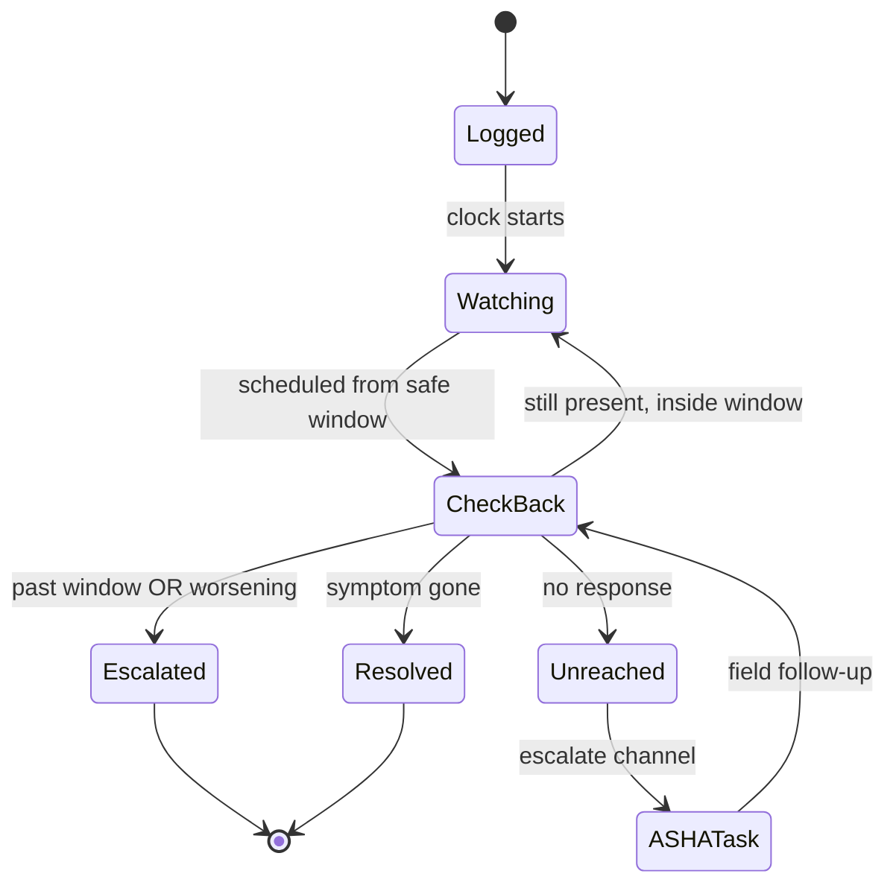
```mermaid
stateDiagram-v2
    [*] --> Logged
    Logged --> Watching: clock starts
    Watching --> CheckBack: scheduled from safe window
    CheckBack --> Resolved: symptom gone
    CheckBack --> Watching: still present, inside window
    CheckBack --> Escalated: past window OR worsening
    CheckBack --> Unreached: no response
    Unreached --> ASHATask: escalate channel
    ASHATask --> CheckBack: field follow-up
    Escalated --> [*]
    Resolved --> [*]
```

### M4 — Diagnostic Loop Detector *(the novelty)*

Care episode schema:

```
Episode {
  date, symptom_cluster_id, provider_type,
  intervention_class,     # antacid | antibiotic | analgesic | advice | ...
  investigation_ordered,  # none | lab | imaging | biopsy | referral
  outcome_at_followup     # resolved | unchanged | worse
}
```

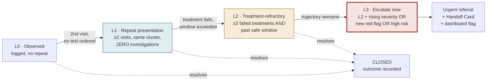
```mermaid
flowchart LR
    L0["L0 · Observed<br/>logged, no repeat"]
    L1["L1 · Repeat presentation<br/>≥2 visits, same cluster,<br/>ZERO investigations"]
    L2["L2 · Treatment-refractory<br/>≥2 failed treatments AND<br/>past safe window"]
    L3["L3 · Escalate now<br/>L2 + rising severity OR<br/>new red flag OR high risk"]
    CL["CLOSED<br/>outcome recorded"]
    ACT["Urgent referral<br/>+ Handoff Card<br/>+ dashboard flag"]

    L0 -->|"2nd visit,<br/>no test ordered"| L1
    L1 -->|"treatment fails,<br/>window exceeded"| L2
    L2 -->|"trajectory worsens"| L3
    L3 --> ACT
    L0 -.->|resolves| CL
    L1 -.->|resolves| CL
    L2 -.->|resolves| CL

    style L1 fill:#e0eef1,stroke:#0d5a6b
    style L2 fill:#f6ecd9,stroke:#8f5d08
    style L3 fill:#f6e4e2,stroke:#a5352b,stroke-width:3px
```

**Supplementary signal — breadth creep:** new symptoms accumulating around the original
one over time (weight loss appearing beside the abdominal pain). A classic late-diagnosis
fingerprint.

**Every transition is a rule, not a prediction.** That is deliberate — the escalation must
be replayable and citable, because it is what justifies asking a clinician to act.

### M5 — Screening Passport

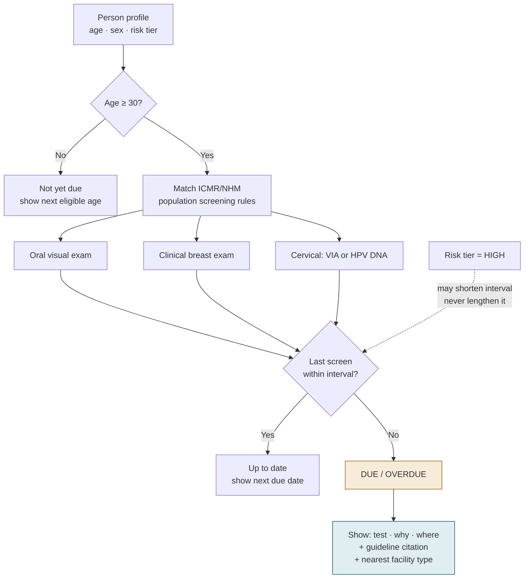
```mermaid
flowchart TD
    A["Person profile<br/>age · sex · risk tier"] --> B{"Age ≥ 30?"}
    B -->|No| C["Not yet due<br/>show next eligible age"]
    B -->|Yes| D["Match ICMR/NHM<br/>population screening rules"]
    D --> E["Oral visual exam"]
    D --> F["Clinical breast exam"]
    D --> G["Cervical: VIA or HPV DNA"]
    E --> H{"Last screen<br/>within interval?"}
    F --> H
    G --> H
    H -->|Yes| I["Up to date<br/>show next due date"]
    H -->|No| J["DUE / OVERDUE"]
    J --> K["Show: test · why · where<br/>+ guideline citation<br/>+ nearest facility type"]
    L["Risk tier = HIGH"] -.->|"may shorten interval<br/>never lengthen it"| H

    style J fill:#f6ecd9,stroke:#8f5d08
    style K fill:#e0eef1,stroke:#0d5a6b
```

Rulesets encoded: **ICMR/NHM Operational Framework** (30+, oral/breast/cervical),
**WHO** cervical guidance (HPV DNA primary; 90-70-90 targets), **USPSTF** as
international fallback. Versioned and swappable per jurisdiction — that configurability
is a strength, not a hedge.

### M6 — Grounded Explanation Layer

```mermaid
flowchart LR I'll further the next piece reported here playing security security crypto walk juna twenty four hours, nor destroy destroy to set, cryptography tokens, a USM barrat digital, I see, and user co stype verification, doesn't itahuma bark digital station battle mission a bd, orlinger bart health account digital mission eBDM because after review however they tell then we start working so there's just reading geling user compromized, I'll shut battle secure, neme or shadwo share no garen, name or us font to business and solution and business model security, my technical vala part, she is doing research paper and most of the technical because model she is doing the technical data, kind of it problement this also because seven o'clock will tell business data set, ca use it is like what grounded formation research research L S to model cony use, you barn cooky sequences, or data set, how are public data sets, research in a public coita set, to have research papers, I seen why in keep findings in our taking whisper, bake nevigation, chartboard aisponsible, futures, linguage, decision, marace valid hogaking break no car filters to be case reserve model one of the most important things to speak about problem and next phases next phases build case have to mention to mara business model because this is no social no dream big wots government so government so how will you manage how will you function sir in gol security cases of cancer would be discovered, so essentially the biggest issue that we found is that the world's state all the initiatives are disappelations was that we can look at the patient's trajectory, we need to be able to depend on the patients and patients and seen once for the investigation as the information as the patient's information is fermented, it's not immediately look at the presentation that service and figure out where the lack of words are invested I did some research on it and we found quite important what means that people is being sick to cancer patients, location, professed the way or can live in there. a century he identified patient as disease are in practitional virus and dex how the industrial mission is in the cake that the rock one hundred eighty days will be the firstinclusion of line third diagnosis additionally on top of that we thirty two before any diagnosis can actually do init if every consultation it is a hundred and data every consultation is a value to independently the pattern is sensitive entire category to pattern obviously the most responsible cases of cancer that oh are actually the ones that are like the longest series from the first symptoms to the first day and run reasons vital location of the effect of data on all sorts of three of the research papers which highlight upon the same things tell the names of the research paper and like you try to like read through this properlynew color to you in India do not availity of people for cancer cancer is found symptoms are never go to create a normal bottom that is available to start symptoms are brought to care but dismissal but dismiss to because they are like array this is nothing mistake this medicine so this is diagnostic when the person was never screwed the person never went for screen program in India according to the survey the late state refifty four percent of Kansas cases present in India and Stage Three or which shows that how much of the big issue there is the survival probability and stage one and two is greater than seventy to eighty percent. Stage one is greater than ninety percent, but over here it drops below fifty every in stage four drops below twenty five percent so that's a lot of difference in life expectancy in modality that is why Ira comes in Ira is automated AI forward assistant awareness assistant and she says only starting to fifty neighborhood since we are not a medical student and we don't want to have any perception so what we did today was that we talked to the NGO crisis introactively take the campaigns with the cancer proactively take part in cancer and campaign so we actually talked actually talked to Shri Ashra from this master and I talk to Miss Sloka from this this we have actually very beautifully we have implemented everything in a pie chart so it okay the first reason for leaning cancer screening is not because they are not taking their life seriously they are normal and they are too embarrass to go for the checkout and as a case second third and then I am not talking about the government of India is simultaneously the health system and its insurance yoja covers five lakh per thans for rule forty eight hundred cross stage one cancer detect accept a lot more amount of money when a cancer is for the step in stage three government saves twice cheaper treatment and a smaller claim against its own ra is not a costline for the government government government it gives five lakh for every cancer patient that approximately hours approximately forty eight hundred crores of cancer which the government spending on the treatment for people comes in this Ira is able to deter the cancer instead by itself when the government will say when you need to stretch you finds it can use for various schools public or those other things words it will be saved in this thing so that is where Ira comes in a is not a cost time for the government its cost avoidance yes we are not selling our apps to consumer we are just enting the government pricing twenty five thousand plus health and wellness center sold it balong with that most or decide because hot tech mechanics security can multilingual bold cancer house for generally generic cancelled for the hardware part we are working on human cancer specifically but that will be like just the last partner is my students fifty lastin the market goals and so in it because I need to model the evaluation issues and raising the past we can go to stress insulate that in the model and research a last win go assess you will in the classroom that team is a little cold capsule installed case online understand how research disarch paper safe windows tick based questioner symptom line plus hand off cards model plus contribution breakdown trajectory model sink plus skin bar consent rash drachboard or alhun camera module separate feature sightation verifier chatbot i d s mock evaluation charts hard or speak five thirty two so it for no skipgeneral cancer protection respect to this vector d for radi and we need explainable explainable AI tell what models non visible profile tax holder how everything should place London basically after and password and the doctor has to import that to add in his client we have S with some users can interface and other details near text or your speech which then be stored and used also make sure to explain the Ayushman Bharat numerical deviates to with point of explainable or security login security of you have submission today so two or three so they really like that's why they have asked online but not very write how we presented because we had the actual twenty all those things and mostly instead of like we wrote on paper and it so that sixty three percent use forty five drawn wait for I play or dwarve everything a b h and website p p phims template medical synthetic medical children sandwich doctors transfers or charportmeal cancer mango little p stuff paper case complicated Saturday North Eastern for the progress explains make sure and it's a shaped seventy six the only time he takes too much doctor connected user can send PDF medical user can upload his medical documents and it will pass the required fields through meta metadata, userboth reactive tax reports,in shara punast message local host screenshots screenshot related, or since I small for the second screenshot maps, but translate me in side around ten dollars just to grab three dollars andcamps we go in red but texting drawns the problems that cannot tell anyone whether they are cancer earlier test can it can tell you how long a symptom is asset against what is expected and what guidelines are as Ira can tell you whether something is Ira cannot tell you whether something is canceled it can tell you whether this is gone longer than the expected time or not a ra does not recommend medicinal doses that decision is belong to the clinician who prescribe for you cannot tell you to start change stop or change a treatment Ira does not give prognosis nothing in systic history supports a statement Ira cannot interpret images into resolve in X ray scans or photographs if you type out what the report is I can tell you what range you are innocent stage a cancer staging means a full imaging and biopsy it can show a clinician the full history emergency text by Hindish redactions emails in cap new exact age plus village is identifying the place by three hundred people if eight is unknown of charent while I spine put it downI can create Juna three point four in a plea web songmodel efforts
    A["Decision<br/>already made<br/>by the rules"] --> B["Retriever<br/>vector search over<br/>NG12 · ICMR · WHO"]
    B --> C["Composer<br/>LLM writes it in<br/>the user's language"]
    C --> D["Verifier<br/>every claim must map<br/>to a retrieved chunk"]
    D -->|pass| E["Emitted<br/>with citation shown"]
    D -->|fail| F["Sentence dropped,<br/>replaced by the<br/>guideline's own wording"]
    F --> E

    style A fill:#e0eef1,stroke:#0d5a6b,stroke-width:3px
    style D fill:#f6ecd9,stroke:#8f5d08
    style E fill:#e2efe8,stroke:#2b6f52
```

**Retrieval reduces hallucination; the verifier prevents it.** The corpus is small and
fixed, so it ships on-device. Never say "a vector DB means it cannot hallucinate" — that
claim dies to one follow-up question.

**Tone rules, enforced in templates:**
- Never a disease name as a conclusion; never a malignancy probability to a lay user
- Output is an *action* and a *timeframe*: "See a doctor within 2 weeks and ask for X"
- Lowest band is never "you are fine" — it is "no action indicated now, return if anything changes," with a re-check date

#### M6 in full — the RAG pipeline, stage by stage

Be able to explain every stage. "We used RAG" is not an answer; this is.

**Stage 0 · Corpus construction.** The corpus is deliberately small, fixed and
authoritative — this is a design choice, not a limitation.

| Source | Approx. chunks | Why included |
|---|---|---|
| NICE NG12 — suspected cancer referral | ~250 | Symptom-level referral thresholds |
| ICMR/NHM Operational Framework | ~150 | Indian population screening policy |
| WHO cervical screening guidance | ~80 | HPV DNA primary screening, 90-70-90 |
| USPSTF screening statements | ~120 | International fallback |
| ICMR-NICPR awareness material | ~200 | Plain-language patient education |
| Curated FAQ (written by us, reviewed) | ~100 | Navigation, cost, what to expect |
| **Total** | **~900** | |

**Stage 1 · Chunking.** Split on semantic boundaries — one recommendation, one paragraph —
not fixed token windows, because guideline text is already structured. Target 200–400
tokens per chunk with ~50 token overlap. Every chunk carries metadata:

```json
{
  "id": "ng12-1.7.3",
  "text": "Consider a suspected cancer pathway referral for oral cancer in people with...",
  "source": "NICE NG12",
  "section": "1.7 Head and neck cancers",
  "url": "https://www.nice.org.uk/guidance/ng12",
  "jurisdiction": "UK",
  "topic": ["oral", "referral"],
  "version": "2015-06, updated 2021"
}
```

**The metadata is not optional.** The citation you display to the user comes from here, and
the verifier in Stage 5 checks against `text`. No metadata means no citation means no
attributable recommendation.

**Stage 2 · Embedding.** Encode each chunk into a vector. Recommended:
`sentence-transformers/all-MiniLM-L6-v2` (384 dimensions, 22M parameters, ~23 MB
quantised) for English, with translation handled at the query boundary rather than by a
heavier multilingual encoder.

> **Honest engineering note to state out loud.** Truly multilingual embedding models
> (LaBSE, multilingual-e5) are 400 MB+ and impractical to ship to a low-end phone. Our
> approach: translate the user's query to English at the edge via Sarvam/Bhashini, retrieve
> in English, then translate the *verified* output back. The guideline corpus is English
> anyway. This is a deliberate trade-off, not an oversight — and being able to say why is
> worth more than pretending the problem does not exist.

**Stage 3 · Index.** 900 chunks × 384 dimensions × 4 bytes ≈ **1.4 MB**. At that scale:

> **We do not use a vector database.** We ship a flat matrix and do exact cosine
> similarity in the browser. An approximate-nearest-neighbour index exists to make search
> sub-linear over millions of vectors; over 900 vectors, exact search is faster than the
> index lookup would be, and it is exact. Pinecone or Weaviate would also require a
> network call, which breaks the offline requirement outright.

Server-side, where the same corpus backs the dashboard, use **`sqlite-vec`** — vector
search as an extension inside the SQLite file you already have. One file, no extra
service. If you prefer a library: **FAISS** (in-process, no server) or **ChromaDB**
(embedded). **Never Pinecone/Weaviate/Qdrant-cloud** for this system — they are network
services and this system must work without a network.

**Stage 4 · Retrieval.** Hybrid, because pure vector search misses exact terms:

```
score = 0.65 × cosine(query_embedding, chunk_embedding)
      + 0.35 × BM25(query_terms, chunk_text)
      + metadata_boost   # jurisdiction match, topic match
```

Retrieve top-k = 8, then **rerank** by a cross-encoder or by simple rule priority
(jurisdiction match first, then guideline recency), then keep top 3.

**Stage 5 · Composition.** The LLM receives: the decision (already made), the retrieved
chunks, the user's language and literacy setting, and a hard system prompt. It is asked to
*express*, never to *decide*.

**Stage 6 · The verifier — the part that actually matters.** Split the generated output
into sentences. For each sentence, compute maximum similarity against the retrieved
chunks. Below threshold → the sentence is **dropped and replaced** by a deterministic
template string built from the rule output.

```python
for sentence in split(generated):
    if max_similarity(sentence, retrieved_chunks) < THRESHOLD:
        emit(template_for(decision))   # deterministic fallback
    else:
        emit(sentence, cite=best_chunk.source)
```

Add a **numeric guard**: any digit appearing in the output that does not appear in a
retrieved chunk or in the rule output is an automatic rejection. Hallucinated numbers are
the most dangerous failure mode in medical text, and this catches them cheaply.

**Stage 7 · Fallback.** If the LLM is unavailable — offline, rate-limited, timed out —
the system emits the **template string** directly. The recommendation is never blocked by
the language layer, because the language layer never produced it. This is the practical
proof that generation is not in the decision path.

#### What to say when a judge attacks the RAG

> **"RAG doesn't prevent hallucination."** — "Correct, and we do not claim it does.
> Retrieval grounds the wording; the *verifier* is what prevents unsourced claims. Every
> sentence we emit is similarity-checked against a retrieved chunk, every number is
> checked against the source, and anything that fails is replaced by a deterministic
> template. And because the decision was made by rules before the model ran, the worst
> case is awkward phrasing — never a wrong recommendation."

> **"Why not fine-tune instead?"** — "Fine-tuning bakes the guideline into weights we
> cannot audit or update. Guidelines change; NG12 has been revised several times. With
> retrieval, updating a recommendation is a JSON edit and a re-embed, and the citation
> stays traceable. Fine-tuning would also destroy the citation trail entirely."

> **"Which vector DB?"** — "None. 900 chunks is 1.4 MB; we do exact cosine search
> in-browser. A vector database at this scale would be over-engineering and would require
> a network call that breaks our offline requirement. Server-side we use `sqlite-vec`,
> inside the SQLite file we already have."

That last answer is the kind of thing that wins technical credibility — knowing when
*not* to use the impressive tool.

### M12 — Awareness & Navigation Chatbot

The field research asked for this indirectly ("just connect some good doctors", "don't
know about cancer"). But an unconstrained medical chatbot is the single easiest way to
violate the brief's core constraint. So it is built as a **scoped assistant with a refusal
router**, not a conversational doctor.

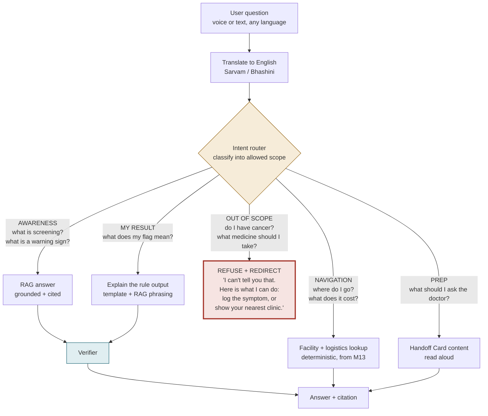
```mermaid
flowchart TD
    Q["User question<br/>voice or text, any language"] --> T["Translate to English<br/>Sarvam / Bhashini"]
    T --> R{"Intent router<br/>classify into allowed scope"}

    R -->|"AWARENESS<br/>what is screening?<br/>what is a warning sign?"| A["RAG answer<br/>grounded + cited"]
    R -->|"NAVIGATION<br/>where do I go?<br/>what does it cost?"| B["Facility + logistics lookup<br/>deterministic, from M13"]
    R -->|"MY RESULT<br/>what does my flag mean?"| C["Explain the rule output<br/>template + RAG phrasing"]
    R -->|"PREP<br/>what should I ask the doctor?"| D["Handoff Card content<br/>read aloud"]
    R -->|"OUT OF SCOPE<br/>do I have cancer?<br/>what medicine should I take?"| E["REFUSE + REDIRECT<br/>'I can't tell you that.<br/>Here is what I can do:<br/>log the symptom, or<br/>show your nearest clinic.'"]

    A --> V["Verifier"]
    C --> V
    V --> O["Answer + citation"]
    B --> O
    D --> O

    style R fill:#f6ecd9,stroke:#8f5d08
    style E fill:#f6e4e2,stroke:#a5352b,stroke-width:3px
    style V fill:#e0eef1,stroke:#0d5a6b
```

**The four allowed intents — the chatbot can do these and nothing else:**

| Intent | Example | Answered by |
|---|---|---|
| Awareness | "What is a mammogram?" | RAG over the corpus, cited |
| Navigation | "Where do I go and what will it cost?" | Deterministic lookup (M13) |
| My result | "Why did it say I should see a doctor?" | Explains the rule output |
| Preparation | "What should I ask the doctor?" | Reads the Handoff Card aloud |

**Everything else is refused by construction.** Diagnosis questions, medication questions,
prognosis questions, second opinions. The refusal is not a policy the model chooses to
follow — the **router never routes those intents to a generative path at all.**

> **Say this:** "The chatbot cannot tell you whether you have cancer, and not because we
> asked it politely. There is no code path from that intent to a generated answer. It
> routes to a refusal and an offer to log the symptom instead — which is the thing that
> actually helps."

**Guardrails, layered:**
1. **Intent router** — a small classifier; out-of-scope never reaches the LLM
2. **Retrieval gate** — if no chunk clears the similarity floor, refuse rather than answer
3. **Verifier** — same as M6, every sentence and every number checked
4. **Output filter** — regex block on disease-conclusion patterns and probability language
5. **Escalation hook** — if the conversation contains a red-flag symptom, the bot stops
   chatting and offers to log it, which triggers the deterministic pathway
6. **Full transcript logging** — every conversation reviewable, for audit and for
   improving the router

### M13 — Navigation & Logistics layer *(field-driven)*

Answers the four questions that actually stop people, ranked 1st, 2nd and 3rd as barriers
in your own survey.

| Question | Data source |
|---|---|
| **Where exactly?** | Facility registry by type — Sub-centre/HWC → PHC → CHC → District Hospital, with the nearest of each |
| **What will it cost?** | **Free under NHM for population screening** — stated explicitly. Cost table per procedure for anything beyond |
| **What do I bring?** | ABHA/ration card, prior reports, the printed Handoff Card |
| **How many visits?** | Screening pathway step count, shown up front so people can plan lost wages |
| **Can I do it remotely?** | eSanjeevani teleconsultation link where available |

**Why this is not a minor feature.** "Too many steps in the process" ranked *above* fear in
your survey. That is a process-design failure and therefore the one barrier software can
fully solve. And "no money" ranked second while the screening is actually free — meaning a
large share of the cost barrier is *belief about cost*. One sentence of copy fixes it.

### M14 — Dignity & Support layer *(field-driven)*

Directly answers "too embarrassed", "scared to get checked", and "no family or social
support".

| Feature | Response to |
|---|---|
| **Private mode by default** — no cancer branding on the home screen; nothing a bystander can read over the shoulder | Embarrassment (4th) |
| **Female health worker preference** flag for breast and cervical pathways | Embarrassment, cultural barriers |
| **Non-cancer framing in default copy** — "a check-up that finds problems early" until the word is necessary | Fear of diagnosis (5th) |
| **Companion flag** — nominate a family member to receive check-back reminders and due dates | No social support (5th) |
| **Accompaniment prompt** on the ASHA dashboard for people with no nominated companion | No social support |

> **The framing to use:** "Fear and embarrassment are usually treated as soft factors that
> a health app cannot address. Our survey ranked them fourth and fifth — above nothing at
> all. So we treated them as design constraints with concrete engineering responses, the
> same way we treated low bandwidth."

### M7 — Accessibility & offline

| Capability | Implementation |
|---|---|
| Offline decision path | All rules in TypeScript, all models ONNX in-browser. Zero network calls to produce a recommendation |
| Storage | IndexedDB via Dexie, encrypted |
| Sync | Outbox queue, last-write-wins per record with a server-side conflict log |
| Language | Sarvam AI for Indic ASR/TTS quality; Bhashini as the government-alignment path; on-device TTS for core phrases offline |
| Low literacy | Body-map tap-to-report, pictogram severity scale, large targets, voice on every screen |
| Feature phones | IVR + SMS pathway (designed for Phase 1, mocked if time allows) |

### M8 — ASHA / CHO Dashboard

Prioritised queue: **L3 flags → L2 flags → overdue screenings → due screenings**.
Village coverage view. Exportable line list.

**Rate budget:** cap flags surfaced per worker per week. A queue nobody can work through
is the same as no queue — say this, it is an operations answer and it is the right one.

### M9 — ABDM integration

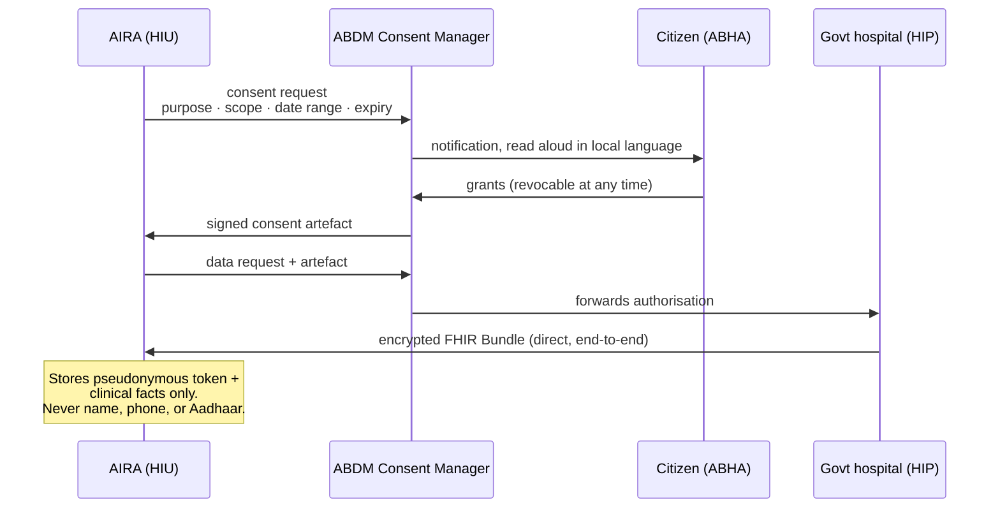
```mermaid
sequenceDiagram
    participant A as AIRA (HIU)
    participant CM as ABDM Consent Manager
    participant U as Citizen (ABHA)
    participant H as Govt hospital (HIP)

    A->>CM: consent request<br/>purpose · scope · date range · expiry
    CM->>U: notification, read aloud in local language
    U->>CM: grants (revocable at any time)
    CM->>A: signed consent artefact
    A->>CM: data request + artefact
    CM->>H: forwards authorisation
    H->>A: encrypted FHIR Bundle (direct, end-to-end)
    Note over A: Stores pseudonymous token +<br/>clinical facts only.<br/>Never name, phone, or Aadhaar.
```

**Key facts to state correctly:**
- ABDM is a protocol, not a database. *It is UPI for health records* — the government
  holds no records, it only routes permission.
- **ABHA** is the health ID (14-digit number + an address like `name@abdm`). Aadhaar is
  one optional way to *create* one; it is never the key used to move records.
- **HIP** holds records, **HIU** wants them, **HIE-CM** manages consent.
- A **consent artefact** is scoped, time-bound, purpose-bound and revocable.
- **FHIR R4** is the data format (HL7 standard; India profiles from NRCeS). An
  `OPConsultation` bundle *is* a care episode — AIRA consumes ABDM data natively.
- Access path: sandbox credentials → **M1** (ABHA identity) → **M2** (HIP) → **M3** (HIU,
  the one you need).

**For Phase 1, say:** *"We implemented the M3 HIU consent flow against a mock gateway
conforming to ABDM's API contract. Sandbox certification is the next step."* Honesty here
is a strength — claiming live government integration in a hackathon gets caught.

### M10 — Oral Cancer Vision Module *(optional focus area)*

**Why oral:** 67% present at Stage III/IV — worst of any screenable site. Tobacco and
gutka driven, so the risk model is clean. Visually screenable with a camera. ASHAs already
perform oral visual examination under the NHM framework.

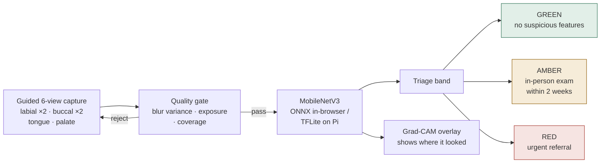
```mermaid
flowchart LR
    A["Guided 6-view capture<br/>labial ×2 · buccal ×2<br/>tongue · palate"] --> B["Quality gate<br/>blur variance · exposure<br/>· coverage"]
    B -->|reject| A
    B -->|pass| C["MobileNetV3<br/>ONNX in-browser /<br/>TFLite on Pi"]
    C --> D["Triage band"]
    C --> E["Grad-CAM overlay<br/>shows where it looked"]
    D --> F["GREEN<br/>no suspicious features"]
    D --> G["AMBER<br/>in-person exam<br/>within 2 weeks"]
    D --> H["RED<br/>urgent referral"]

    style F fill:#e2efe8,stroke:#2b6f52
    style G fill:#f6ecd9,stroke:#8f5d08
    style H fill:#f6e4e2,stroke:#a5352b
```

**Triage, never diagnosis.** If asked: *"a lesion is diagnosed by biopsy."* That is the
correct answer and it ends the question.

### M11 — Hardware: AIRA Field Kit *(COULD tier)*

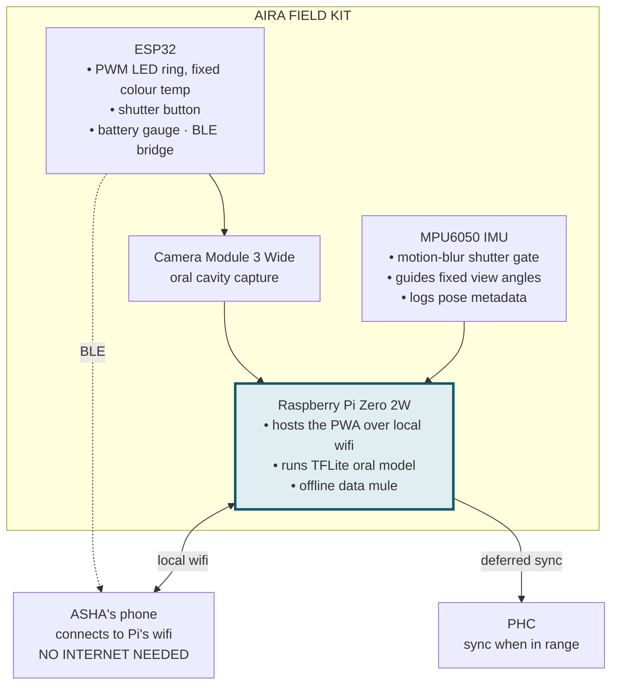
```mermaid
flowchart TB
    subgraph KIT["AIRA FIELD KIT"]
        PI["Raspberry Pi Zero 2W<br/>• hosts the PWA over local wifi<br/>• runs TFLite oral model<br/>• offline data mule"]
        CAM["Camera Module 3 Wide<br/>oral cavity capture"]
        IMU["MPU6050 IMU<br/>• motion-blur shutter gate<br/>• guides fixed view angles<br/>• logs pose metadata"]
        ESP["ESP32<br/>• PWM LED ring, fixed colour temp<br/>• shutter button<br/>• battery gauge · BLE bridge"]
    end
    PHONE["ASHA's phone<br/>connects to Pi's wifi<br/>NO INTERNET NEEDED"]
    PHC["PHC<br/>sync when in range"]

    CAM --> PI
    IMU --> PI
    ESP --> CAM
    ESP -.->|BLE| PHONE
    PI <-->|local wifi| PHONE
    PI -->|"deferred sync"| PHC

    style PI fill:#e0eef1,stroke:#0d5a6b,stroke-width:3px
```

Each component earns its place — say why, or it reads as decoration:

| Part | Justification |
|---|---|
| Pi Zero 2W | A village with **zero internet** still gets the full application over the Pi's own wifi hotspot |
| MPU6050 | Blocks the shutter on motion blur and guides the operator to fixed angles. **Inconsistent framing is the #1 cause of field vision-model failure** — an untrained ASHA now produces consistent images |
| ESP32 | Fixed colour-temperature illumination. **Inconsistent lighting is the #2 cause** |

## 2.7 User journeys

### Individual / self-serve

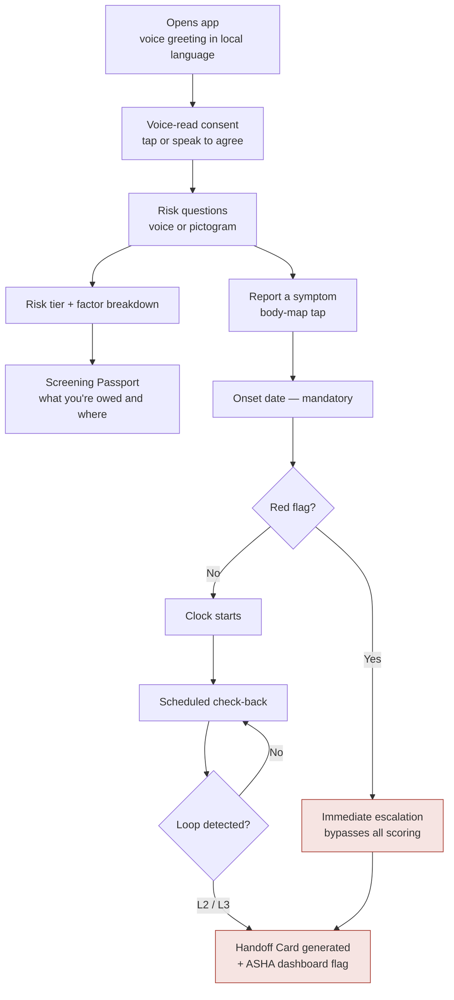
```mermaid
flowchart TD
    A["Opens app<br/>voice greeting in local language"] --> B["Voice-read consent<br/>tap or speak to agree"]
    B --> C["Risk questions<br/>voice or pictogram"]
    C --> D["Risk tier + factor breakdown"]
    D --> E["Screening Passport<br/>what you're owed and where"]
    C --> F["Report a symptom<br/>body-map tap"]
    F --> G["Onset date — mandatory"]
    G --> H{"Red flag?"}
    H -->|Yes| I["Immediate escalation<br/>bypasses all scoring"]
    H -->|No| J["Clock starts"]
    J --> K["Scheduled check-back"]
    K --> L{"Loop detected?"}
    L -->|"L2 / L3"| M["Handoff Card generated<br/>+ ASHA dashboard flag"]
    L -->|No| K
    I --> M

    style I fill:#f6e4e2,stroke:#a5352b
    style M fill:#f6e4e2,stroke:#a5352b
```

### ASHA / CHO

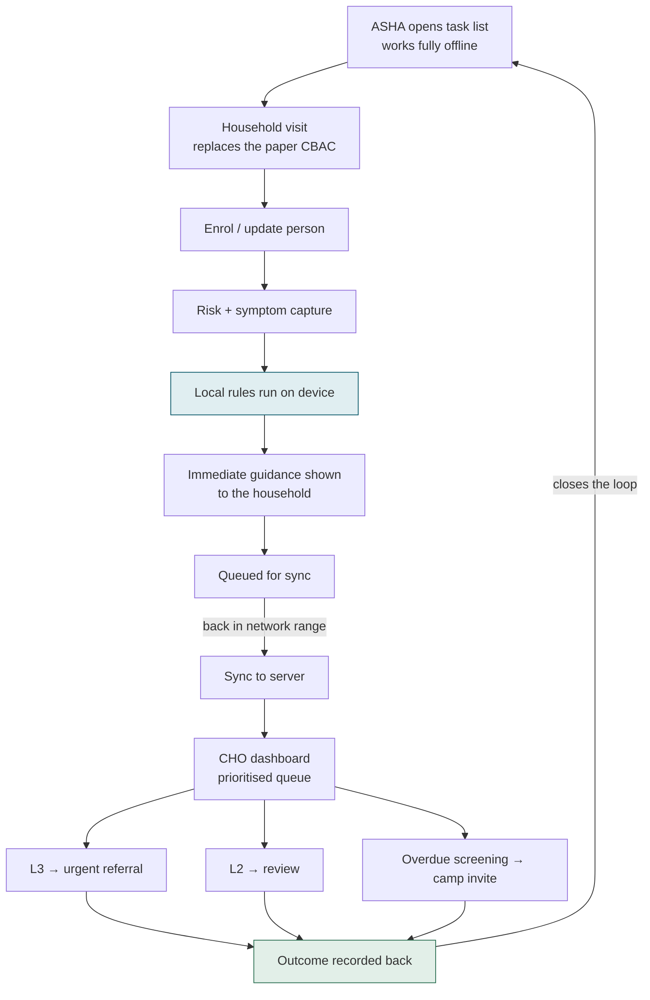
```mermaid
flowchart TD
    A["ASHA opens task list<br/>works fully offline"] --> B["Household visit<br/>replaces the paper CBAC"]
    B --> C["Enrol / update person"]
    C --> D["Risk + symptom capture"]
    D --> E["Local rules run on device"]
    E --> F["Immediate guidance shown<br/>to the household"]
    F --> G["Queued for sync"]
    G -->|"back in network range"| H["Sync to server"]
    H --> I["CHO dashboard<br/>prioritised queue"]
    I --> J["L3 → urgent referral"]
    I --> K["L2 → review"]
    I --> L["Overdue screening → camp invite"]
    J --> M["Outcome recorded back"]
    K --> M
    L --> M
    M -->|"closes the loop"| A

    style E fill:#e0eef1,stroke:#0d5a6b
    style M fill:#e2efe8,stroke:#2b6f52
```

**Outcome capture (M) is the most under-appreciated step.** It is the only real training
signal the system will ever generate, and it is what makes AIRA improve rather than
ossify.

---

# PART 3 — Execution plan

## 3.1 Technology stack

| Layer | Choice | Why this and not the alternative |
|---|---|---|
| **App** | React + Vite + TypeScript, PWA | Fast build, PWA gives offline for free |
| **Styling** | Tailwind | Speed |
| **Local DB** | Dexie (IndexedDB) | Structured queries offline; simpler than raw IDB |
| **Service worker** | Workbox | Precache the shell, background sync |
| **Rules** | Plain TypeScript over versioned JSON | Runs offline; no model call needed to decide |
| **Backend** | FastAPI + SQLModel | Team likely knows Python; fast to write |
| **Database** | **SQLite**, not Postgres | 48 hours, zero ops, identical demo |
| **Live channel** | **SSE**, not WebSockets | Dashboard only. A persistent socket over an intermittent rural link drops and drains battery — the field app uses a sync queue instead |
| **Tabular ML** | InterpretML **EBM**, XGBoost as benchmark | Glass box ships; black box benchmarks it |
| **Trajectory** | Engineered temporal features + LightGBM | Sequences are 2–6 steps and irregular — **an LSTM is the wrong tool** |
| **Vision** | PyTorch → ONNX + TFLite | Browser and Pi from one training run |
| **Symptom NLP** | Small multilingual sentence encoder, ONNX in-browser | Free-text → ontology mapping. Not a server transformer |
| **Voice** | Sarvam AI + Bhashini | Quality + government alignment |
| **Retrieval** | Local embeddings over a small fixed corpus | Corpus is ~hundreds of chunks; no vector server needed |

### Why not an LSTM — the answer to have ready

1. **Sequences are tiny.** 2–6 care episodes. LSTMs are built for hundreds of steps; with 4 they overfit instantly.
2. **Sampling is irregular.** Visits at day 0, 18, 52, 96. LSTMs assume even spacing; handling this properly needs T-LSTM or time-aware attention — heavy machinery for 4 points.
3. **It is a black box**, which fights the explainability requirement written into the brief.

Instead, engineer the temporal signal into features a clinician can read:

```
duration_ratio       = days_elapsed / safe_window      ← the dominant feature
n_episodes           = visits for this symptom cluster
n_failed_treatments  = interventions with outcome ≠ resolved
severity_slope       = linear fit over severity scores
breadth_creep        = new associated symptoms since onset
investigation_gap    = 1 if red flag present and no test ordered
provider_switches    = distinct provider types seen
```

*If you want a sequence model for the "we also explored" slide, use a **GRU with
attention** — fewer parameters than an LSTM, and the attention weights are the
explanation. Report it as exploration; ship the feature-based model.*

## 3.2 Repository structure

```
aira/
├─ packages/
│  ├─ rules/                      # THE BRAIN — shared, zero dependencies
│  │  ├─ data/
│  │  │  ├─ symptoms.json         # ontology + safe windows + NG12 citations
│  │  │  ├─ risk-factors.json     # additive weights + literature citations
│  │  │  ├─ screening.json        # ICMR / WHO / USPSTF rulesets
│  │  │  └─ redflags.json         # always-escalate list
│  │  ├─ src/{risk,persistence,loop,screening}.ts
│  │  └─ tests/                   # unit tests = instant credibility
│  ├─ app/                        # React PWA
│  │  ├─ features/{onboarding,risk,symptom-log,timeline,
│  │  │            camera,passport,handoff,checkback}
│  │  └─ db/                      # Dexie schema + sync queue
│  ├─ dashboard/                  # ASHA / CHO view
│  └─ api/                        # FastAPI + SQLite
├─ ml/
│  ├─ cohort/generate.py          # epidemiologically-grounded simulator
│  ├─ train_casefinding.py        # EBM + XGBoost benchmark
│  ├─ train_trajectory.py         # temporal features + LightGBM
│  ├─ train_oral.py               # CNN → ONNX + TFLite
│  └─ eval/                       # calibration, AUPRC, decision curve
├─ device/                        # Pi + ESP32 firmware
├─ seed/personas.json             # pre-built demo histories
└─ docs/
```

## 3.2b Databases — from first principles

*Written assuming no prior database coursework. Read this section fully; database
questions are among the most common in technical judging, and they are easy points.*

### What a database actually is

A **database** is organised, persistent storage that survives your program exiting. A
**DBMS** (database management system) is the software that manages it — SQLite, Postgres,
MySQL, MongoDB.

Two families:

| | **Relational (SQL)** | **Document / NoSQL** |
|---|---|---|
| Shape | **Tables** — rows and columns, like a spreadsheet | **Documents** — nested JSON objects |
| Schema | Fixed and enforced up front | Flexible, enforced by the application |
| Links | **Foreign keys** — explicit relationships | Embedding or manual references |
| Language | SQL | Per-product APIs |
| Best for | Structured data with relationships and integrity requirements | Rapidly changing or deeply nested shapes |
| Examples | SQLite, PostgreSQL, MySQL | MongoDB, Firestore, CouchDB |

**AIRA is relational, and here is the one-sentence reason:** our data is inherently
relational — one person has many symptoms, one symptom has many care episodes, one episode
has one outcome — and the integrity of those relationships is a *safety* property. If an
episode can exist without a valid symptom, the Loop Detector produces a wrong level. A
relational database enforces that with foreign keys; a document store would make it the
application's problem.

### Core vocabulary you must be able to define

| Term | Definition |
|---|---|
| **Table** | A collection of rows with the same columns. `symptoms`, `episodes` |
| **Row / record** | One entry. One logged symptom |
| **Column / field** | One attribute. `onset_date` |
| **Primary key (PK)** | The column that uniquely identifies a row. Never reused, never null |
| **Foreign key (FK)** | A column pointing at another table's primary key. This is what enforces "every episode belongs to a real person" |
| **Index** | A lookup structure that makes searching a column fast. Without one, the DB scans every row |
| **Query** | A request for data, written in SQL |
| **Transaction** | A group of operations that all succeed or all fail together — **atomicity** |
| **ACID** | Atomicity, Consistency, Isolation, Durability — the guarantees a relational DB gives you |
| **Normalisation** | Storing each fact once, in one place, to avoid contradictory duplicates |
| **Migration** | A versioned change to the schema, applied in order, so every deployment matches |

**On ACID, if asked why it matters here:** when a check-back response arrives and
simultaneously changes the symptom status *and* appends an episode *and* recomputes the
loop level, either all three happen or none do. A partial write would leave a person
flagged at a level the evidence does not support. That is a clinical safety argument for a
database property — a genuinely good answer.

### The three stores in AIRA, and why each exists

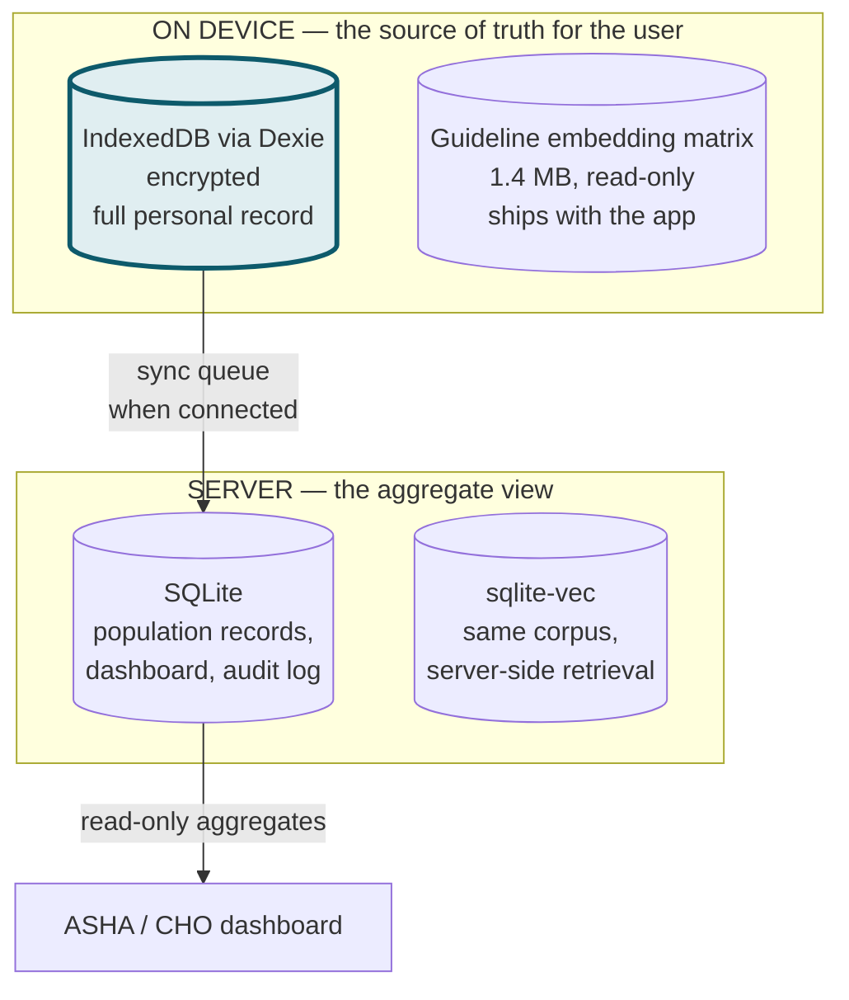
```mermaid
flowchart TB
    subgraph DEVICE["ON DEVICE — the source of truth for the user"]
        IDB[("IndexedDB via Dexie<br/>encrypted<br/>full personal record")]
        VEC[("Guideline embedding matrix<br/>1.4 MB, read-only<br/>ships with the app")]
    end
    subgraph SERVER["SERVER — the aggregate view"]
        SQL[("SQLite<br/>population records,<br/>dashboard, audit log")]
        SVEC[("sqlite-vec<br/>same corpus,<br/>server-side retrieval")]
    end
    IDB -->|"sync queue<br/>when connected"| SQL
    SQL -->|"read-only aggregates"| DASH["ASHA / CHO dashboard"]

    style IDB fill:#e0eef1,stroke:#0d5a6b,stroke-width:3px
```

| Store | Technology | Holds | Why this one |
|---|---|---|---|
| **Client** | **IndexedDB** via **Dexie.js** | The person's full record — profile, symptoms, episodes, flags, outbox | The only browser database that persists structured data offline at size. `localStorage` is 5–10 MB and synchronous, so it blocks the UI — wrong tool |
| **Server** | **SQLite** via SQLModel | Population records, dashboard views, audit log, sync conflicts | Zero operational overhead, single file, ACID, more than fast enough for a district. **Postgres is the migration path, not the starting point** |
| **Retrieval** | Flat matrix (client) / **`sqlite-vec`** (server) | 900 guideline chunk embeddings | At 1.4 MB, exact search beats an index. See M6 Stage 3 |

**The answer to "why SQLite and not Postgres?"** — "SQLite is a single file with no server
process and full ACID guarantees. For a district-scale deployment the read and write
volumes are trivial, and the operational simplicity matters more when the deployment
target is a state health department, not a cloud team. The schema and the ORM are
identical, so moving to Postgres when we outgrow it is a connection string change. We
chose the smallest thing that is correct."

That is a much stronger answer than "Postgres because it's production-grade."

### The schema

```sql
-- ── People ───────────────────────────────────────────────────────────────
CREATE TABLE person (
    id                TEXT PRIMARY KEY,       -- pseudonymous UUID, never a name
    abha_token        TEXT UNIQUE,            -- optional, encrypted at rest
    year_of_birth     INTEGER NOT NULL,       -- NOT date of birth: minimisation
    sex               TEXT NOT NULL,
    village_id        TEXT REFERENCES village(id),
    risk_tier         TEXT,                   -- Average | Elevated | High
    risk_computed_at  TEXT,
    consent_version   TEXT NOT NULL,
    created_at        TEXT NOT NULL
);

-- Identifiers live apart from the clinical record, so the clinical tables
-- can be exported for analysis without ever carrying identity.
CREATE TABLE person_identity (
    person_id   TEXT PRIMARY KEY REFERENCES person(id) ON DELETE CASCADE,
    name_enc    BLOB,                         -- encrypted
    phone_enc   BLOB                          -- encrypted
);

-- ── Risk factors ─────────────────────────────────────────────────────────
CREATE TABLE risk_factor (
    id          TEXT PRIMARY KEY,
    person_id   TEXT NOT NULL REFERENCES person(id) ON DELETE CASCADE,
    factor_code TEXT NOT NULL,                -- 'tobacco_smokeless', 'fh_breast_1deg'
    value       TEXT,                         -- '20_years', 'mother_age_51'
    points      REAL NOT NULL,                -- contribution, for the breakdown UI
    source_ref  TEXT NOT NULL,                -- citation for the weight
    recorded_at TEXT NOT NULL
);

-- ── Symptoms — the longitudinal spine ────────────────────────────────────
CREATE TABLE symptom (
    id              TEXT PRIMARY KEY,
    person_id       TEXT NOT NULL REFERENCES person(id) ON DELETE CASCADE,
    symptom_code    TEXT NOT NULL,            -- FK into symptoms.json ontology
    cluster_id      TEXT NOT NULL,            -- groups related symptoms
    onset_date      TEXT NOT NULL,            -- MANDATORY: starts the clock
    severity        INTEGER,                  -- 1-5
    status          TEXT NOT NULL,            -- watching | resolved | escalated
    safe_window_days INTEGER NOT NULL,        -- snapshotted from the ruleset
    ruleset_version TEXT NOT NULL,            -- WHICH version decided this
    is_red_flag     INTEGER NOT NULL DEFAULT 0,
    created_at      TEXT NOT NULL
);

-- ── Care episodes — what feeds the Loop Detector ─────────────────────────
CREATE TABLE episode (
    id                    TEXT PRIMARY KEY,
    person_id             TEXT NOT NULL REFERENCES person(id) ON DELETE CASCADE,
    cluster_id            TEXT NOT NULL,
    encounter_date        TEXT NOT NULL,
    provider_type         TEXT,   -- asha|phc|chc|private|informal|pharmacy
    intervention_class    TEXT,   -- antacid|antibiotic|analgesic|advice|none
    investigation_ordered TEXT NOT NULL DEFAULT 'none',
                                  -- none|lab|imaging|biopsy|referral
    outcome_at_followup   TEXT,   -- resolved|unchanged|worse|unknown
    source                TEXT NOT NULL,      -- self_report | abdm | asha
    created_at            TEXT NOT NULL
);

-- ── Check-backs ──────────────────────────────────────────────────────────
CREATE TABLE checkback (
    id            TEXT PRIMARY KEY,
    symptom_id    TEXT NOT NULL REFERENCES symptom(id) ON DELETE CASCADE,
    scheduled_for TEXT NOT NULL,
    channel       TEXT,   -- push|sms|ivr|asha
    responded_at  TEXT,
    response      TEXT,   -- resolved|same|worse|no_response
    attempt_no    INTEGER NOT NULL DEFAULT 1
);

-- ── Flags — every decision, replayable ───────────────────────────────────
CREATE TABLE flag (
    id              TEXT PRIMARY KEY,
    person_id       TEXT NOT NULL REFERENCES person(id) ON DELETE CASCADE,
    cluster_id      TEXT,
    level           TEXT NOT NULL,            -- L1 | L2 | L3 | RED_FLAG
    reason_json     TEXT NOT NULL,            -- the full reasoning trail
    ruleset_version TEXT NOT NULL,
    guideline_ref   TEXT NOT NULL,
    raised_at       TEXT NOT NULL,
    acknowledged_by TEXT,
    outcome         TEXT,                     -- referred|investigated|overridden
    override_reason TEXT                      -- training signal
);

-- ── Screening ────────────────────────────────────────────────────────────
CREATE TABLE screening_event (
    id            TEXT PRIMARY KEY,
    person_id     TEXT NOT NULL REFERENCES person(id) ON DELETE CASCADE,
    test_code     TEXT NOT NULL,              -- oral_visual|cbe|via|hpv_dna
    due_date      TEXT,
    completed_date TEXT,
    result        TEXT,
    facility_type TEXT,
    guideline_ref TEXT NOT NULL
);

-- ── Sync + audit ─────────────────────────────────────────────────────────
CREATE TABLE outbox (
    id          TEXT PRIMARY KEY,
    table_name  TEXT NOT NULL,
    row_id      TEXT NOT NULL,
    op          TEXT NOT NULL,                -- insert | update | delete
    payload     TEXT NOT NULL,
    device_id   TEXT NOT NULL,
    client_ts   TEXT NOT NULL,
    synced_at   TEXT
);

CREATE TABLE audit_log (
    id          TEXT PRIMARY KEY,
    actor       TEXT NOT NULL,
    action      TEXT NOT NULL,
    person_id   TEXT,
    consent_ref TEXT,
    at          TEXT NOT NULL
);                                            -- append-only, never updated

-- ── Indexes — the queries we actually run ────────────────────────────────
CREATE INDEX idx_symptom_person_status ON symptom(person_id, status);
CREATE INDEX idx_symptom_cluster       ON symptom(cluster_id);
CREATE INDEX idx_episode_cluster_date  ON episode(cluster_id, encounter_date);
CREATE INDEX idx_flag_level_raised     ON flag(level, raised_at DESC);
CREATE INDEX idx_checkback_due         ON checkback(scheduled_for)
                                          WHERE responded_at IS NULL;
CREATE INDEX idx_screening_due         ON screening_event(due_date)
                                          WHERE completed_date IS NULL;
```

### Five design decisions in that schema worth defending out loud

1. **`year_of_birth`, not `date_of_birth`.** Age band is all the rules need. Storing less
   is data minimisation under the DPDP Act — a privacy decision visible *in the schema*.
2. **Identity split into `person_identity`.** The clinical tables carry no name or phone,
   so a research or dashboard export is pseudonymous by construction rather than by a
   careful analyst.
3. **`ruleset_version` stamped on every symptom and flag.** Guidelines change. Without the
   version, a flag raised last year becomes unexplainable when NG12 is revised. **This is
   what makes a decision replayable — the single most important column in the schema for
   your explainability claim.**
4. **`safe_window_days` snapshotted onto the row.** Denormalisation, done deliberately: the
   clock a person was judged against must not silently change under them when the ruleset
   updates.
5. **`override_reason` captured on flags.** Every clinician disagreement is recorded. This
   is the only genuine training signal the system will ever produce (see §3.3c).

**On normalisation, if asked:** "We normalise everything except two deliberate exceptions —
`safe_window_days` and the risk `points` are snapshotted onto the row, because they are
*historical facts about a decision*, not current configuration. Denormalising there is
correct; denormalising anywhere else would not be."

### Sync and conflict resolution

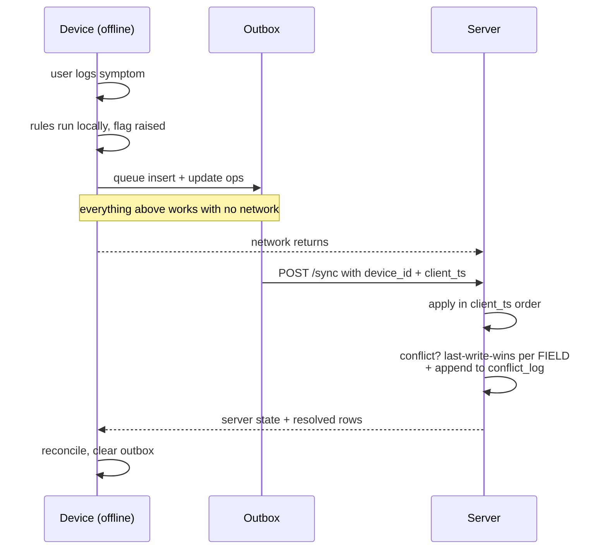
```mermaid
sequenceDiagram
    participant D as Device (offline)
    participant O as Outbox
    participant S as Server

    D->>D: user logs symptom
    D->>D: rules run locally, flag raised
    D->>O: queue insert + update ops
    Note over D,O: everything above works with no network
    D-->>S: network returns
    O->>S: POST /sync with device_id + client_ts
    S->>S: apply in client_ts order
    S->>S: conflict? last-write-wins per FIELD<br/>+ append to conflict_log
    S-->>D: server state + resolved rows
    D->>D: reconcile, clear outbox
```

**The policy, stated plainly:** append-only tables (`episode`, `checkback`, `audit_log`)
**never conflict** — two devices adding episodes is just a union. Mutable fields
(`symptom.status`, `person.risk_tier`) use **last-write-wins by field**, with every
resolution written to a conflict log a human can review.

> **If asked "why not CRDTs?"** — "Conflict-free replicated data types would give us
> automatic merge, but they are a multi-day build and our conflict surface is tiny: one
> person's record is edited by that person and at most one ASHA. Append-only for the
> clinical history plus last-write-wins on a handful of status fields covers the real
> cases. We chose the smallest correct mechanism, and we log every resolution so nothing
> is silently lost."

Knowing what a CRDT is *and* why you did not use one is a better answer than using one.

### Security at the database layer

| Control | Implementation |
|---|---|
| Encryption at rest, client | Web Crypto API — key derived from a device credential; encrypted values in IndexedDB |
| Encryption at rest, server | SQLCipher, or encrypted columns for `person_identity` |
| Encryption in transit | TLS 1.3 |
| Access control | Row-level: an ASHA sees only her assigned village; a CHO only her facility |
| Audit | `audit_log` is append-only, no UPDATE or DELETE grant |
| Right to erasure | `ON DELETE CASCADE` from `person` purges everything; audit log retains the erasure event only |
| Aggregates | Dashboard views k-anonymised — no cell below a threshold count rendered |
| Backups | Encrypted, with the same retention schedule as live data |

### Database questions you will be asked, with answers

> **"Why relational and not MongoDB?"** — "Our data is inherently relational and the
> integrity of those relationships is a safety property. If an episode can exist without a
> valid symptom, the Loop Detector computes a wrong level. Foreign keys enforce that in the
> database; a document store makes it the application's problem."

> **"How do you handle offline?"** — "The device is the source of truth for that person.
> IndexedDB holds the full record, all rules run locally, and writes go to an outbox that
> drains when a network appears. No feature waits on connectivity, because no decision
> requires the server."

> **"What happens if two devices edit the same person?"** — "Clinical history is
> append-only, so it merges by union. The handful of mutable status fields use
> last-write-wins by field with every resolution written to a conflict log for human
> review. We deliberately did not build CRDTs — the conflict surface is one person and one
> ASHA."

> **"How does this scale to a state?"** — "A district is roughly two million people and a
> few million rows — comfortably within SQLite. At state scale we move to Postgres with
> read replicas and partition by district; the ORM and schema are unchanged, so it is a
> connection-string change. We deliberately did not start there."

> **"How do you know a flag was computed correctly six months ago?"** — "Every symptom and
> flag stores the `ruleset_version` that produced it and the full reasoning trail in
> `reason_json`. We can check out that version of the JSON and replay the decision exactly.
> That is what makes the system auditable rather than merely explainable."

> **"Is patient data safe?"** — "The clinical tables contain no name or phone — identity is
> split into a separate encrypted table, so any export is pseudonymous by construction. We
> store year of birth rather than date of birth. Inference runs on device, so raw symptom
> data need never leave the phone at all."

## 3.3 ML pipeline

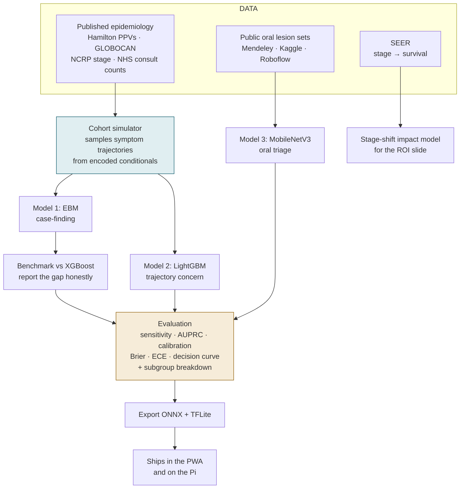
```mermaid
flowchart TB
    subgraph DATA["DATA"]
        D1["Published epidemiology<br/>Hamilton PPVs · GLOBOCAN<br/>NCRP stage · NHS consult counts"]
        D2["SEER<br/>stage → survival"]
        D3["Public oral lesion sets<br/>Mendeley · Kaggle · Roboflow"]
    end

    D1 --> SIM["Cohort simulator<br/>samples symptom trajectories<br/>from encoded conditionals"]
    SIM --> TRAIN1["Model 1: EBM<br/>case-finding"]
    SIM --> TRAIN2["Model 2: LightGBM<br/>trajectory concern"]
    D3 --> TRAIN3["Model 3: MobileNetV3<br/>oral triage"]
    D2 --> IMPACT["Stage-shift impact model<br/>for the ROI slide"]

    TRAIN1 --> BENCH["Benchmark vs XGBoost<br/>report the gap honestly"]
    BENCH --> EVAL["Evaluation<br/>sensitivity · AUPRC · calibration<br/>Brier · ECE · decision curve<br/>+ subgroup breakdown"]
    TRAIN2 --> EVAL
    TRAIN3 --> EVAL
    EVAL --> EXPORT["Export ONNX + TFLite"]
    EXPORT --> SHIP["Ships in the PWA<br/>and on the Pi"]

    style SIM fill:#e0eef1,stroke:#0d5a6b
    style EVAL fill:#f6ecd9,stroke:#8f5d08
```

### The data plan, stated honestly

There is **no** large public dataset of Indian primary-care symptom trajectories with
cancer outcomes. Pretending otherwise gets you caught. Say this instead:

> "We built an **epidemiologically-grounded synthetic cohort**. Rather than inventing
> data, we encoded published conditional probabilities — Hamilton's symptom PPVs,
> GLOBOCAN and NCRP incidence by age and sex, Indian stage distributions, NHS
> consultation-count distributions — into a generative simulator, then sampled
> trajectories from it. The model learns epidemiology the literature already established.
> This validates the **pipeline**, not clinical performance. Clinical validation requires
> a prospective cohort with registry linkage, and that is our stated next step."

Judges respect stated limitations far more than inflated accuracy claims.

## 3.3c Datasets — the full catalogue, and what to do when data does not exist

*This is the section a technical judge is most likely to probe, because it is where most
hackathon projects are weakest. Know every row of this table.*

### Datasets that genuinely exist and are obtainable

| Dataset | Source / access | What it gives us | Used for | Realistic in 48h? |
|---|---|---|---|---|
| **SEER** | US NCI, free with a data-use agreement | ~1.5M+ registry records: site, **stage**, age, sex, survival | Stage→survival impact model; the ROI slide; stage-distribution priors | Agreement takes days — **apply now**, use published summary tables meanwhile |
| **NCRP / ICMR reports** | Published PDFs, free | Indian incidence and stage distribution by site and state | Indian priors for the simulator | ✅ Immediately |
| **NFHS-5** | DHS Program, free registration | Screening coverage, socioeconomic gradient, ~600k+ households | Coverage baseline; equity view on the dashboard | ✅ Summary tables immediately; microdata in ~1 day |
| **GLOBOCAN / Global Cancer Observatory** | IARC, free | Incidence and mortality by country, site, age, sex | Age/sex incidence priors | ✅ Immediately |
| **DDXPlus** | Public, ~1.3M synthetic patients | Symptom + antecedent → differential diagnosis, multilingual | Symptom-ontology structure; a real benchmark for the symptom encoder | ✅ Immediately |
| **NCI CDAS — PLCO / NLST** | Free, application required | **Real screening trial data** with symptoms, screening history, outcomes | The closest thing to real longitudinal screening data | Application takes weeks — cite as the validation path |
| **Mendeley "Oral Cancer (Lips and Tongue) images"** | Free download | Clinical oral photographs, labelled | Oral vision model | ✅ Immediately |
| **Kaggle / Roboflow oral lesion sets** | Free | Additional oral images, some with bounding boxes | Augmenting the vision training set | ✅ Immediately |
| **NICE NG12, ICMR framework, WHO guidance** | Free web/PDF | The rule content itself | **The rules engine and the RAG corpus** | ✅ Immediately |

### Datasets people will ask about that you cannot get — know why

| Dataset | Why not |
|---|---|
| **CPRD / QResearch** (the data QCancer was built on) | UK primary care records; requires institutional agreement, ethics approval, and months. Cite it as the gold standard we are approximating |
| **UK Biobank** | Application + fee + months |
| **MIMIC-IV** | ICU data — wrong population entirely. Mention only to show you know it is wrong |
| **Any Indian primary-care symptom→outcome dataset at scale** | **It does not exist publicly.** This is the actual gap, and naming it is a contribution |

> **The honest headline:** "There is no public dataset of Indian primary-care symptom
> trajectories with cancer outcomes. That absence is not our project's weakness — it is
> the reason the project needs to exist. AIRA is, among other things, an instrument for
> generating exactly that dataset."
>
> That reframe is powerful. Say it.

### How we train when the data is not there — five strategies, in order

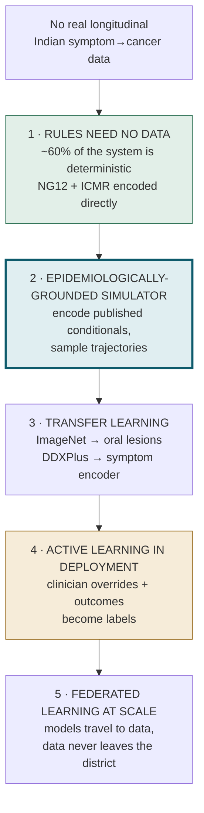
```mermaid
flowchart TB
    A["No real longitudinal<br/>Indian symptom→cancer data"] --> S1
    S1["1 · RULES NEED NO DATA<br/>~60% of the system is deterministic<br/>NG12 + ICMR encoded directly"] --> S2
    S2["2 · EPIDEMIOLOGICALLY-GROUNDED SIMULATOR<br/>encode published conditionals,<br/>sample trajectories"] --> S3
    S3["3 · TRANSFER LEARNING<br/>ImageNet → oral lesions<br/>DDXPlus → symptom encoder"] --> S4
    S4["4 · ACTIVE LEARNING IN DEPLOYMENT<br/>clinician overrides + outcomes<br/>become labels"] --> S5
    S5["5 · FEDERATED LEARNING AT SCALE<br/>models travel to data,<br/>data never leaves the district"]

    style S1 fill:#e2efe8,stroke:#2b6f52
    style S2 fill:#e0eef1,stroke:#0d5a6b,stroke-width:3px
    style S4 fill:#f6ecd9,stroke:#8f5d08
```

**Strategy 1 — Most of the system needs no training data at all.**
The Persistence Clock, the Loop Detector's rule transitions, the Risk Tier points model and
the Screening Passport are all **direct encodings of published guidelines**. They are
already "validated" in the strongest sense available: a national body validated them and
published them. *Roughly 60% of AIRA's decision surface requires zero training data.* Lead
with this when challenged — it disarms the whole line of attack.

**Strategy 2 — The epidemiologically-grounded simulator.** Explain it concretely:

```python
# For each simulated person:
#  1. Sample age, sex from Indian census distribution
#  2. Sample risk factors from NFHS-5 prevalence (tobacco, alcohol, BMI)
#  3. Sample true disease state using GLOBOCAN/NCRP incidence
#     conditioned on age, sex and those risk factors
#  4. Given the disease state, sample symptoms using published PPVs
#     inverted via Bayes:  P(symptom | cancer) from Hamilton et al.
#  5. Sample a care trajectory using NHS consultation-count distributions
#     (18.1% have >=3 pre-referral consultations)
#  6. Sample investigation behaviour from our NGO field findings
#     (empirical treatment given, test not ordered)
#  7. Emit the full longitudinal record
```

**Note step 6 — your NGO interviews parameterise the simulator.** That is a genuine
contribution and it connects Part 1 to Part 3. No other team will have field-derived
parameters in their data generator.

**What this validates and what it does not** — say both halves:
- ✅ The pipeline runs end to end; the rules fire correctly; the model learns the encoded
  epidemiology; the ranking is sane; calibration can be measured
- ❌ It does **not** establish clinical performance. The model can only learn the
  epidemiology we put in. Real data will contain patterns we did not encode

**Strategy 3 — Transfer learning.** For the oral model, ImageNet pre-training then
fine-tune on a few thousand oral images; freeze early layers, train the head, then unfreeze
gradually. Heavy augmentation — rotation, colour jitter, brightness — because field
lighting varies wildly (which is exactly what the ESP32 LED ring and the MPU6050 exist to
control). For the symptom encoder, start from a sentence-transformer and adapt on DDXPlus.

**Strategy 4 — Active learning in deployment.** This is the answer to "how does it get
better?"

```
Every clinician override captured  →  a label
Every outcome recorded             →  a label
Every resolved symptom             →  a negative label
Every confirmed cancer             →  a positive label, with its full trajectory
```

**The system is designed to manufacture its own training data.** That is why
`override_reason` and `outcome` are columns in the schema (§3.2b) rather than an
afterthought. Prioritise labelling where the model is least confident — that is classical
uncertainty sampling, and naming it is a good technical signal.

**Strategy 5 — Federated learning at scale.** The forward-looking answer: health data
cannot leave a district for legal and political reasons, so at scale the **model travels to
the data**. Each district trains locally; only weight updates are aggregated centrally.
Combine with differential privacy on the updates. **Describe this; do not build it in 48
hours.** Being able to say "here is how this scales without centralising health data" is
worth a slide.

### The cold-start problem — asked more often than you expect

> **"Your system needs history, but a new user has none. What happens on day one?"**

The answer is layered, and it is genuinely good:

1. **Risk assessment works instantly** — age, sex and family history need no history at all
2. **Screening Passport works instantly** — it is a function of age, sex and risk tier
3. **Red-flag detection works instantly** — a hard-coded list, no history required
4. **ABDM record pull provides retrospective history** — this is precisely why M9 matters:
   it back-fills a timeline the user never manually entered
5. **Retrospective intake** — onboarding asks "have you had this before? how many times
   have you seen someone about it?", constructing a partial history from recall
6. **The Loop Detector then activates from the second episode onward**

> **Say this:** "Cold start is real and we designed for it. Four of our six outputs work on
> day one with zero history. The Loop Detector needs a second encounter to fire — and that
> is not a limitation, it is the definition of the problem. Nobody can detect a repeat
> presentation before the repeat."

### Data quality and bias — name the problems before they do

| Problem | Honest statement | Mitigation |
|---|---|---|
| Western training data | SEER is US; NG12 is UK; NHS consultation data is UK. **Indian breast cancer peaks ~a decade earlier; smokeless tobacco dominates oral risk; TB co-prevalence changes what a cough means** | Indian priors from NCRP/GLOBOCAN in the simulator; jurisdiction-swappable rulesets; state the limitation on the slide |
| Vision dataset skew | Oral image sets are small and often clinical-photography lighting, not field conditions | Standardised illumination (ESP32), report subgroup performance, heavy augmentation |
| Self-reported symptoms | Recall bias; severity is subjective | Onset date is mandatory and anchored to events; ASHA-verified entries flagged separately |
| Class imbalance | Cancer prevalence is well under 1% | AUPRC not AUROC; threshold from NICE's 3% PPV rule; class weighting. **Mention SMOTE only to note it can distort calibration** — that caveat is the sophisticated answer |
| Selection bias in deployment | People who use an app differ from those who do not — and the excluded are the highest risk | ASHA-mediated enrolment; IVR/SMS path; report coverage by wealth quintile as an equity metric |

### Metrics — never report accuracy

At ~0.5% prevalence, a model that always says "no cancer" is 99.5% accurate and useless.
Report instead:

- **Sensitivity/recall at a fixed operating point** — the primary metric
- **Specificity** and resulting referral volume (workload cost)
- **PPV and NPV at stated prevalence** — always state the prevalence
- **AUPRC** (more informative than AUROC under imbalance)
- **Calibration** — reliability curve, Brier score, expected calibration error
- **Decision curve analysis** (Vickers & Elkin) — net benefit vs threshold. *Produce one
  and you will be the only team that did.*
- **Subgroup performance** by age, sex, urban/rural — your fairness evidence

**Operating point:** tied to NICE's published **3% PPV threshold**, so it is clinically
justified rather than an arbitrary F1 optimum.

## 3.4 The 48-hour schedule

| Phase | Hours | Deliverable | Owner |
|---|---|---|---|
| **P0** | 0–3 | Repo scaffold, data models, **the 4 JSON rulesets** | All (pair on rulesets) |
| **P1** | 3–7 | Cohort simulator + EBM training + calibration/decision curve | ML |
| **P2** | 3–9 | Rules engines + unit tests (parallel with P1) | Rules |
| **P3** | 9–11 | **Seed 4 demo personas + time-travel control** | Rules |
| **P4** | 11–22 | PWA: onboarding → risk → symptom log → **timeline** → passport → **handoff card** | Frontend ×2 |
| **P5** | 22–29 | Oral vision: train, ONNX, guided capture, Grad-CAM | ML |
| **P6** | 22–30 | Offline hardening + sync queue + ASHA dashboard | Backend |
| **P7** | 30–34 | Voice + language + pictograms | Frontend |
| **P8** | 34–40 | Hardware field kit | Hardware |
| **P9** | 40–48 | Deck rewrite, rehearse ×3, **code freeze at 46** | All |

### Ship gates — the discipline that saves you

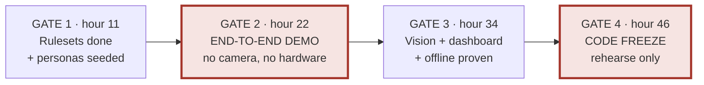
```mermaid
flowchart LR
    G1["GATE 1 · hour 11<br/>Rulesets done<br/>+ personas seeded"] --> G2["GATE 2 · hour 22<br/>END-TO-END DEMO<br/>no camera, no hardware"]
    G2 --> G3["GATE 3 · hour 34<br/>Vision + dashboard<br/>+ offline proven"]
    G3 --> G4["GATE 4 · hour 46<br/>CODE FREEZE<br/>rehearse only"]

    style G2 fill:#f6e4e2,stroke:#a5352b,stroke-width:3px
    style G4 fill:#f6e4e2,stroke:#a5352b,stroke-width:3px
```

**Gate 2 is non-negotiable.** By hour 22 you must have a working demo with no camera and
no hardware. Everything after that is upside. If Gate 2 slips, cut F15 and F19 immediately
rather than pushing the gate.

**⚠️ P3 is the phase teams always skip and always regret.** You cannot log three months of
symptoms live on stage. Pre-seed the personas at hour 9, not hour 44.

## 3.5 Team allocation (adapt to your headcount)

| Role | Owns | Hackathon deliverable |
|---|---|---|
| **Rules & data** | The 4 JSON rulesets, all four engines, unit tests, seeded personas | The auditable core |
| **Frontend ×2** | PWA, timeline, handoff card, offline, voice, pictograms | Everything the judges see |
| **ML** | Cohort simulator, EBM + benchmark, evaluation suite, oral CNN | The model slide + Grad-CAM |
| **Backend / hardware** | FastAPI, sync, dashboard, then the field kit | The dashboard + the kit |
| **Everyone** | Rehearsal from hour 44 | Three full run-throughs |

If you are four people, fold backend into frontend and give hardware to whoever finishes
first — hardware is COULD tier, and it is the correct thing to sacrifice.

## 3.6 Demo script — 7 minutes

| # | Time | Beat |
|---|---|---|
| 1 | 0:30 | **Hook** — "Three visits. Two antacids. Nine months. Stage III. This happens because doctor #2 never knew what doctor #1 tried." |
| 2 | 0:45 | **Live risk assessment** — voice, local language, explainable factor breakdown |
| 3 | 1:30 | **Time-travel the persona** — scrub the timeline: visit 1, visit 2 → L1 fires → visit 3 → **L3 treatment-refractory**. Show the reasoning trail |
| 4 | 0:45 | **Print the Handoff Card** — hold up the physical paper. *"This is what breaks the cycle."* |
| 5 | 1:00 | **Camera triage** — capture a lesion, Grad-CAM overlay, amber band |
| 6 | 0:30 | **Turn wifi OFF** — everything still works. Turn it on — it syncs |
| 7 | 0:45 | **ASHA dashboard** — "17 people in this village are overdue. 2 are in a diagnostic loop right now." |
| 8 | 0:30 | **Close** — CBAC alignment, SDG 3.4, *"early signs should not be ignored twice."* |

Beats 3, 4 and 6 are the ones judges will remember. Rehearse those three until they are
automatic.

## 3.7 Risk register

| Risk | Likelihood | Impact | Mitigation |
|---|---|---|---|
| Oral image dataset too small / poor quality | High | Medium | Report exact size and class balance; present as triage aid with stated limits. Grad-CAM carries the demo even at modest accuracy |
| Live demo fails on stage | Medium | High | Seeded personas + time-travel means no live data entry. Record a backup video at hour 44 |
| Offline sync bugs eat hours | Medium | High | Outbox queue with last-write-wins; do not build CRDTs |
| Voice API rate limits / latency | Medium | Medium | On-device TTS for core phrases; pre-record the demo language |
| Hardware doesn't work in the venue | Medium | Low | It is COULD tier. Have photos and a block diagram as fallback |
| Judge challenges the synthetic data | High | High | **Pre-empt it** — state the limitation on the slide before they ask (§3.3, §3.3c) |
| Scope creep | High | High | The MUST/SHOULD/COULD tiering in §2.3 is the contract. Cut from the bottom |
| SEER data-use agreement not approved in time | High | Low | Published NCRP/SEER summary tables are enough for the priors and the ROI model. Apply anyway — the pending application is itself evidence of a real validation path |
| Sync/conflict bugs corrupt the demo record | Medium | High | Clinical tables are append-only, so they cannot conflict. Only status fields merge, and every resolution is logged (§3.2b) |
| Chatbot says something it should not | Medium | **High** | The intent router blocks out-of-scope before the LLM is reached; verifier + numeric guard on output; regex filter on disease-conclusion patterns (M12) |
| Ruleset numbers cannot be traced to NG12 in time | Medium | High | Ship only the entries you have verified against source text. **A smaller cited ruleset beats a larger unsourced one** |
| Someone asks for the NGO contact to verify | Low | Medium | Have organisation names and the interview protocol ready; anonymise individuals on slides and be able to describe the method |

## 3.8 Beyond the hackathon — validation roadmap

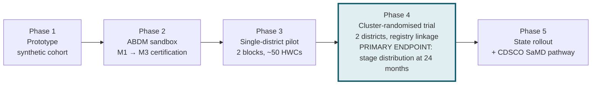
```mermaid
flowchart LR
    A["Phase 1<br/>Prototype<br/>synthetic cohort"] --> B["Phase 2<br/>ABDM sandbox<br/>M1 → M3 certification"]
    B --> C["Phase 3<br/>Single-district pilot<br/>2 blocks, ~50 HWCs"]
    C --> D["Phase 4<br/>Cluster-randomised trial<br/>2 districts, registry linkage<br/>PRIMARY ENDPOINT: stage distribution at 24 months"]
    D --> E["Phase 5<br/>State rollout<br/>+ CDSCO SaMD pathway"]

    style D fill:#e0eef1,stroke:#0d5a6b,stroke-width:3px
```

**Naming the trial design is what makes you credible.** When a judge asks "how would you
prove this works," the answer is a *cluster-randomised pilot across two districts with
cancer registry linkage, primary endpoint stage distribution at 24 months* — not "we'd
collect user feedback."

---

# PART 4 — Non-technical

## 4.1 Business model — B2G, with the insight that closes it

Most health apps sell to consumers. Yours should not.

> **The Government of India is simultaneously the health system *and* the insurer.**
> Through PM-JAY it covers ₹5 lakh per family per year; cancer care alone accounted for
> **₹4,800 crore** of PM-JAY expenditure. When a cancer is caught at Stage I instead of
> Stage III, the government saves twice — cheaper treatment, and a smaller claim against
> its own scheme.
>
> **AIRA is not a cost line for a government buyer. It is cost avoidance.**

| Buyer | Budget line | Motivation |
|---|---|---|
| **State Health Society / NHM** | State NCD & cancer programme | Screening coverage targets they are currently missing |
| **District administration** | District health budget | Pilot scale, fastest to close |
| **NHA** | PM-JAY | Claims cost avoidance |
| CSR arms *(secondary)* | Mandated 2% CSR spend | Rural health is a qualifying head; funds pilots while procurement runs |
| Private insurers *(secondary)* | Underwriting | They want stage shift for the same reason NHA does |

## 4.2 Unit economics — with assumptions stated

**Pricing:** ₹25,000 per Health & Wellness Centre per year — software, updates, support,
dashboard. An HWC catchment is ~5,000 people, of whom ~2,200 are 30+.

→ **≈ ₹11 per screened adult per year.** Small enough to be credible, easy to defend.

**One district, worked:**

```
Population                                  2,000,000
Adults 30+ (~45%)                             900,000
HWCs (~5,000 catchment each)                      400
ANNUAL CONTRACT  400 × ₹25,000                ₹1.0 crore

New cancers/year (~100 per 100,000)             2,000
Currently Stage III/IV (54%)                    1,080
ASSUMPTION: 5 percentage-point stage shift        100 cases move late → early
Treatment cost differential (indicative)     ₹5,00,000 per case
                                            ─────────────
GROSS ANNUAL VALUE                            ₹5.0 crore
COST                                          ₹1.0 crore
RETURN                                                5×
```

**Flag the weak link before a judge does:** the 5-point stage shift is the assumption
requiring validation, and §3.8 names the study that would validate it.

**Revenue path — present the path, not the ceiling:**

```
Year 1  · 2 districts                    ~₹2 crore
Year 3  · 1 state (~10,000 HWCs)        ~₹25 crore/year
Year 5+ · national (~150,000 HWCs)     ~₹375 crore/year
```

A team that says *"₹2 crore in year one, here's the pilot design"* beats a team that says
*"₹375 crore TAM."*

**Cost structure:** marginal cost per additional HWC is near zero, so gross margin is
high. The real costs are **ASHA training** and **field support**, which scale with
geography rather than users — model those explicitly.

**Honest risks:** government procurement takes 12–24 months (mitigate with CSR-funded
pilots in parallel); ASHAs are incentive-paid, so AIRA must **replace** the paper CBAC,
not sit beside it; clinical validation is a prerequisite for scale, not a nice-to-have.

## 4.3 Impact metrics — how you would measure success

| Level | Metric | Target |
|---|---|---|
| **Primary outcome** | Stage distribution at diagnosis — % Stage I/II | +5 pp over 24 months |
| Process | Screening coverage in catchment (vs 1.9% / 0.9% / 0.9% baseline) | 10× baseline |
| Process | Median primary care interval for flagged patients | −30 days |
| Process | % of L2/L3 flags acted on within 14 days | >70% |
| Reach | Adults 30+ enrolled per HWC | >60% of catchment |
| Equity | Coverage gap between top and bottom wealth quintile | Narrowing |
| Economic | Avoided catastrophic health expenditure events | Modelled from stage shift |

Note the structure: a **primary outcome** (mortality-relevant, hard to move, honestly
long-dated) plus **process metrics** (movable within a pilot). That structure is how real
public-health programmes are evaluated, and using it signals seriousness.

## 4.4 Responsible AI — enforced by mechanisms, not disclaimers

| Commitment | The mechanism |
|---|---|
| **Never diagnoses** | Output vocabulary is a closed set of actions and tiers. No disease name as a conclusion; no malignancy probability to a lay user |
| **Never falsely reassures** | No "all clear" state exists. Lowest band: *"no action indicated right now — return if anything changes,"* always with a re-check date |
| **Model cannot de-escalate** | Rule levels are a floor. Learned components may raise attention or reorder a queue; they have **no write path** to a flag |
| **Every recommendation attributable** | Guideline citation shown in the UI — authority is the guideline, not the algorithm |
| **Explanations are exact** | Glass-box additive model: the explanation *is* the model, not a post-hoc estimate |
| **Errors surfaced** | Subgroup performance, calibration, decision curve — never a single accuracy figure |
| **Clinician stays decision-maker** | One-tap override capturing a reason; flag volume rate-budgeted per worker per week |
| **Data minimisation** | On-device inference, pseudonymous tokens, purpose-bound revocable consent, full audit log. DPDP Act 2023 |

**The failure mode to name before they ask:**

> "False reassurance is our most dangerous failure mode, and we engineered against it
> specifically. We never emit an all-clear. A hard-coded red-flag list escalates
> regardless of any model score. And we run at a deliberately sensitivity-first operating
> point, because a false positive costs one consultation while a false negative costs a
> stage."

### Security posture

| Layer | Control |
|---|---|
| Identity | Pseudonymous token as primary key; name/phone stored separately, encrypted, never in the clinical record |
| At rest | Encrypted IndexedDB on device; encrypted columns server-side |
| In transit | TLS 1.3; ABDM bundles encrypted end-to-end hospital → AIRA |
| Authorisation | Consent artefact per data pull — scoped, time-bound, revocable |
| Audit | Append-only access log, viewable by the citizen |
| Minimisation | On-device inference — raw symptom data need never leave the phone |
| Retention | Defined deletion schedule; revocation triggers purge |
| Aggregates | Dashboard views k-anonymised; no cell below threshold displayed |

### Regulatory framing

**SaMD** (Software as a Medical Device, IMDRF framework) classifies software by the
significance of the information it provides and the seriousness of the condition. In
India, CDSCO regulates under the Medical Devices Rules 2017. Software that *informs*
clinical management sits in a lower risk class than software that *drives* or
*diagnoses*. AIRA is deliberately built as **informs** — it recommends a guideline-defined
next step to a human, and a human decides.

> **The constraint is enforced in the output layer, not in a footer.**

## 4.5 Differentiation — against named prior art

Never claim novelty in general. Claim it against something specific, and concede what it
does better — conceding accurately is what makes the rest believable.

| Prior art | Does well | Cannot do |
|---|---|---|
| **QCancer** (NHS-deployed, Hippisley-Cox) | Validated symptom + risk case-finding across hundreds of UK practices. Proves the premise is real | **Cross-sectional.** Needs a complete GP record. Cannot represent *"treated twice, not improving."* Cannot run with no record and no network |
| **CBAC** (India's NCD checklist) | Already mandated, staffed, reaching every household with an adult 30+. Scale you could never build | **Paper. One-time.** No memory between visits |
| **Consumer symptom checkers** | Accessible, familiar interaction model | Generative decisions, no audit trail, no citation, no longitudinal state |
| **Screening camps** | Genuinely effective when they run | Episodic and untargeted — nobody tracks who was due, who came, who was never invited. Hence ~1% coverage |

**The three claims, in this order:**

1. **Longitudinal, not cross-sectional.** We compute the second-order signal — that the
   benign explanation has now failed twice — which no deployed system computes, because
   none of them hold the history.
2. **Patient-held and offline.** The record belongs to the person, so it survives the
   change of provider that causes the information loss in the first place.
3. **The last mile of policy that already exists.** India *has* the screening programme;
   coverage is 1.9% / 0.9% / 0.9%. We are the delivery layer, not a new policy.

**The sentence that reframes the whole project:**

> "CBAC is a one-time paper snapshot. AIRA is CBAC made longitudinal, digital and
> self-escalating. We are not asking India to adopt a new instrument — we are giving an
> instrument it already mandates a memory."

## 4.6 How we differ from the OTHER TEAMS

§4.5 differentiates you from *deployed products*. This section differentiates you from
*the other twenty teams solving SH-HLT-05 in the same room* — which is the differentiation
that actually decides the result.

### Predict what they will build

Every team receives the same brief, and the brief steers hard toward a predictable
solution. Expect most of the room to present some combination of:

| What most teams will present | Why it is weak | Why yours differs |
|---|---|---|
| **An LLM symptom-checker chatbot** — "describe your symptoms, AI tells you the risk" | Generative decisions with no audit trail. Violates the decision-support constraint in spirit. Hallucinates | Our LLM is **structurally outside** the decision path; a router blocks the diagnosis intent from reaching it at all |
| **A Kaggle cancer dataset + XGBoost, "97% accuracy"** | Accuracy on an imbalanced problem is meaningless. The dataset is usually a diagnostic dataset (already-biopsied tumours), not a *case-finding* one | We refuse to report accuracy, and we say why. We report **AUPRC, calibration and a decision curve**, at a threshold justified by NICE's 3% rule |
| **A form that computes a risk score** | Cross-sectional. Answers requirement 1, ignores 2 and 3 entirely | Requirement 3 — misdiagnosis detection — is our **centrepiece**, not an afterthought |
| **A language dropdown labelled "multilingual"** | Translation is not accessibility for a non-reader | Voice-first, body-map pictograms, and **voice-read consent** — which we argue is a *legal* requirement under DPDP, not a nicety |
| **"Offline-capable" as a bullet point** | Usually means the shell caches; the decision still needs a server | Our **entire decision path is deterministic TypeScript** running on device. We prove it live by switching wifi off |
| **A generic "we'll integrate with government systems" claim** | No specifics; falls apart on one question | We name **ABDM M3 HIU**, the consent artefact, FHIR R4, NRCeS profiles, and admit we ran against a mock gateway |
| **Cited statistics from news articles** | Unverifiable | Every number traced to GLOBOCAN, NCRP, NFHS-5, Hamilton BMJ 2007, or NICE — with the source on the slide |

### The ten things no other team will have

Rank these by how hard they are to replicate. Lead the pitch with 1, 2 and 3.

| # | Asset | Why it is hard to replicate |
|---|---|---|
| **1** | **Primary field research** — a six-question protocol run with four cancer NGOs, plus a public survey | **You cannot fake this and you cannot do it in 48 hours.** It is already done. It is your single most defensible advantage |
| **2** | **The Diagnostic Loop Detector** — a formal L0→L3 ladder over care episodes | Requirement 3 is the hardest requirement in the brief and the one most teams will hand-wave. We have a state machine with named transitions |
| **3** | **The Doctor Handoff Card** — a printed page addressed to the *next clinician* | Everyone builds for the patient or the doctor's dashboard. Nobody builds the artefact that travels *between visits* — which is where the information is actually lost |
| **4** | **The decision boundary** — rules decide, models rank, LLM only phrases | A structural answer to "ethical and explainable" rather than a disclaimer in a footer |
| **5** | **Guideline citation on every single output** | Requires actually encoding NG12 and the ICMR framework as data, which is unglamorous work most teams skip |
| **6** | **Calibration + decision curve analysis** | Almost nobody at a hackathon produces a decision curve. It is the accepted way to show a clinical model is *useful*, not just accurate |
| **7** | **Scheduled check-backs where silence is treated as a signal** | Everyone builds login-triggered reminders. Recognising that non-response is the highest-risk state is a domain insight |
| **8** | **CBAC positioning** — "an instrument India already mandates, given a memory" | Requires knowing CBAC exists. Converts the project from an app into a national-programme upgrade |
| **9** | **Explicit non-goals** — a WILL-NOT-BUILD list | Reads as engineering maturity. Most teams over-claim scope and get caught |
| **10** | **Knowing when *not* to use the impressive tool** — no vector DB, no LSTM, SQLite not Postgres, each with a reason | This is what separates students who have read about the tools from engineers who have chosen between them |

### The three "we deliberately did not" answers

These land harder than any feature, because they demonstrate judgement rather than effort.
Have all three ready verbatim.

> **"We deliberately did not use an LSTM."** Our sequences are two to six care episodes,
> irregularly spaced. An LSTM is built for hundreds of evenly-spaced steps; with four it
> overfits instantly, and it is a black box fighting our explainability requirement. We
> engineered the temporal signal into features a clinician can read — duration over safe
> window, count of failed treatments, severity slope — and used gradient boosting. On data
> this small, feature engineering beats deep learning, and we can show you why.

> **"We deliberately did not use a vector database."** Our guideline corpus is 900 chunks —
> 1.4 megabytes. Exact cosine search in the browser is faster than an approximate index
> lookup at that scale, and it is exact. A hosted vector database would also require a
> network call, which breaks the offline requirement outright.

> **"We deliberately did not put the language model in the decision path."** The rules make
> the decision, the model ranks it, the LLM only phrases it. That is why our
> recommendations are replayable, citable, and work with no network. It is also why a
> model failure degrades our output to a template string rather than to a wrong clinical
> recommendation.

### Be honest about what is *not* novel

Overclaiming is the fastest way to lose a technically strong judge. Concede these
proactively — it buys credibility for the claims that *are* real:

| Component | Honest status |
|---|---|
| Symptom + risk-factor case-finding | **Not novel.** QCancer does this and is NHS-deployed. We say so, and we use it as evidence the premise works |
| Oral lesion CNN | **Not novel.** There is a published literature on smartphone oral screening. Our contribution is the *capture standardisation*, not the classifier |
| RAG with citation | **Not novel** as a technique. The verifier and the refusal router are careful engineering, not research |
| Offline-first PWA | **Not novel.** Standard practice, applied properly |
| **Longitudinal loop detection over care episodes** | **This is the novel part.** No deployed system computes the second-order signal that the benign explanation has already failed |
| **The patient-held handoff artefact** | **Novel in application.** The idea is old — the discharge summary — but nobody generates it *from the patient's own longitudinal record for the next primary-care visit* |

> **Say this:** "Most of our components are not novel, and we will tell you which ones. The
> novelty is in one specific place: we compute a signal nobody computes, because nobody
> holds the history it requires. Everything else is careful engineering in service of that
> one idea."

That sentence is worth more than claiming everything is new. Judges have heard enough
teams claim novelty in everything.

### The elevator answer to "how are you different?"

Thirty seconds, memorised:

> "Three ways. First, we did primary research — six questions to four cancer NGOs, and
> every single one independently described the same failure: repeated antibiotics with no
> diagnostic test ordered. Second, we built the thing they asked for, which was a patient
> timeline — and on top of it, a detector for exactly that failure pattern. Third, our AI
> cannot make a clinical decision, structurally: the rules decide, the model only ranks,
> and the language model only phrases. Most teams here will show you a chatbot that
> guesses. We are showing you a safety net that remembers."

---

## Appendix — deck structure for Phase 1

Map your slides to the judging criteria explicitly:

| Slide | Content | Criterion |
|---|---|---|
| 1 | Title + the tagline | — |
| 2 | The hook: three visits, two antacids, Stage III | Understanding |
| 3 | **Our field research — 4 NGOs, 6 questions (§1.6)** | **Understanding — lead with this** |
| 4 | **Finding 1: 4/4 said "repeated treatment, no test ordered"** | Understanding |
| 5 | **Finding 2: they asked for "a patient timeline"** | Understanding + Alignment |
| 6 | Root cause tree (§1.2) | Understanding |
| 7 | The delay pathway + intervention points (§1.3) | Understanding |
| 8 | The base-rate insight + the NHS statistic | Understanding |
| 9 | The 1.9% / 0.9% / 0.9% slide | Understanding |
| 10 | **Barrier taxonomy → feature mapping (§1.8)** | **Understanding → Alignment bridge** |
| 11 | **Traceability matrix (§2.2)** | **Alignment** |
| 12 | System architecture (§2.4) | Alignment |
| 13 | The decision boundary (§2.5) | Alignment + ethics |
| 14 | Loop Detector ladder (§2.6 M4) | Alignment — the novelty |
| 15 | Handoff Card mock-up | Alignment |
| 16 | Check-back loop — silence as a signal (§2.6 M3) | Alignment |
| 17 | Oral module + Grad-CAM | Alignment — optional focus |
| 18 | Stack + model choices with justification (§3.1) | Execution |
| 19 | **Data plan + the honest limitation (§3.3, §3.3c)** | **Execution — pre-empt the attack** |
| 20 | Database schema + the `ruleset_version` argument (§3.2b) | Execution |
| 21 | 48-hour schedule + ship gates (§3.4) | Execution |
| 22 | Risk register + explicit non-goals (§2.3, §3.7) | Execution |
| 23 | **"How we differ from the other teams" (§4.6)** | **Alignment** |
| 24 | Differentiation vs deployed products (§4.5) | Alignment |
| 25 | Business model + unit economics (§4.1–4.2) | Impact |
| 26 | Validation roadmap (§3.8) | Execution |
| 27 | Impact metrics (§4.3) | Impact |
| 28 | Close: CBAC sentence + tagline | — |

**If you only get 10 slides:** 1, 3, 4, 5, 11, 13, 14, 15, 21, 28. That sequence is field
research → traceability → decision boundary → the novelty → the artefact → the plan →
close. It answers all three judging criteria and leads with the asset nobody can copy.

---

*Companion document: `understanding.txt` — domain depth, full statistics with sources,
vocabulary sheet, and anticipated judge questions with prepared answers.*

*Decision-support and awareness system. Not a diagnostic device.*
